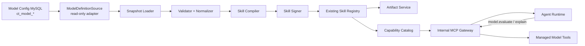

# Model Skill 转换服务

> **状态**：最小闭环已实现；生产稳定化待实施
> **日期**：2026-07-24
> **依据**：MySQL `ct_model_*` 现有表结构与样本、[[23 MCP Runtime 能力平面]]
> **范围**：把租户模型定义编译成 AuraClaw Skill Package，并通过内部 MCP Capability Gateway
> 提供给 Agent；不让 Agent 或 Runtime 直连 MySQL，不把自然语言公式当成可信执行代码。

## 1. 结论

`ct_model_*` 不是一组可以直接复制为 `SKILL.md` 的文档，而是一套模型 DSL：

- `definition/version` 定义模型身份和不可变版本；
- `input_source/input_feature/feature_mapping/dependency` 定义数据入口与模型依赖；
- `weight/threshold/tag/switch` 定义计算、分类、适用场景和启停约束；
- `output_schema/output_sink` 定义输出契约与副作用；
- `execution/result/current/writeback_log/event_outbox` 是执行与交付状态。

因此转换服务采用“**编译器 + 发布协调器**”定位：

1. 从只读模型源装载一个 tenant 下的完整版本快照；
2. 规范化并进行结构、引用、语义和安全校验；
3. 生成确定性的 Skill Package；
4. 签名后调用现有 Skill Registry 发布；
5. 由现有 MCP Resource、Catalog、Skill Resolver 和 Skill Runner 提供给 Agent。

Skill 只描述何时使用模型、如何收集输入、如何处理依赖、如何解释结果以及何时请求审批。
真正的公式计算、执行记录、结果回写和事件发送由受管的确定性 MCP Tool 完成，不能交给 LLM
自由计算。

### 1.1 当前最小闭环

为尽快验证链路，首期实现刻意采用以下简化：

```text
MySQL ct_model_* 固定只读 SELECT
 -> ModelSkillSnapshot
 -> ModelSkillCompiler
 -> 签名 SkillPackage
 -> 现有 SkillPackageRegistry / McpResourceRegistry
 -> skill://ct-model/... Resources
 -> HandsClient / HandsRuntimeAdapter
 -> Agent Runtime
```

- `action-hands` 启动时读取一个配置的源 tenant；
- Draft 版本映射成 `<semver>-draft.<version_id>`，可被 Agent 加载但明确标为预览；
- `manifest.json`、`SKILL.md`、`references/config.json` 和模型摘要通过 MCP 暴露；
- 生成的 Skill 不声明执行 Tool，并明确禁止权威计算、回写和自行补全规则；
- 例外是通过代码注册并严格校验的 `config_snapshot_json.auraclaw_skill` 执行模板；首个模板
  `procurement-price-insight-atomic-v1` 可绑定固定的只读原子 Tool，或在 v2 配置中依赖固定
  的平台子 Skill。未注册模板仍禁止执行；
- 开发环境可使用固定本地签名键，生产启用源读取时必须提供独立签名键；
- MySQL 到 AuraClaw tenant 通过显式配置映射，默认仅服务 development 演示。

本阶段直接读库是为了缩短验证路径，并不代表最终生产边界已经确定。以下事项记录为后续决策：

- 发布配置应由接口、版本快照表还是只读库提供；
- 如何保证跨表一致快照、增量通知和重复/乱序恢复；
- Skill Publication 如何持久化并在多副本重启后恢复；
- 权重、阈值和自然语言量化规则如何升级为确定性 DSL；
- 输入数据应通过受管接口、Resource 还是专用 read-only Tool 获取；
- 模型计算、结果查询和回写 Tool 的幂等、审批及 Fencing 契约。

### 1.2 Tool 与 Skill 的复用层级

```text
受治理数据接口
  -> 原子 Tool（一个固定动作或一个固定指标）
  -> 领域子 Skill（短 SOP + 可复用 Tool 集）
  -> 场景 Skill（业务意图、分支、输出组织）
```

`SkillManifest.required_skills` 声明签名子 Skill 的名称、版本约束和 publisher。Resolver
递归解析依赖、检测循环、对每层执行角色与策略校验，并把 Tool、Resource 去重后固定到根
Binding。Runtime 分批加载依赖，并按“子 Skill 在前、场景 Skill 在后”的顺序注入签名指令。
子 Skill 不能授予父 Skill 未经 Policy 允许的能力。

## 2. 当前数据理解

### 2.1 表分组

| 分组 | 表 | 转换用途 |
|---|---|---|
| 身份与版本 | `ct_model_definition`、`ct_model_version` | Skill 名称、版本、描述、发布资格和源快照 |
| 输入 | `ct_model_input_source`、`ct_model_input_feature`、`ct_model_feature_mapping` | 输入 Schema、数据获取计划、默认值和转换 |
| 模型依赖 | `ct_model_dependency` | 上游模型 DAG、必需/可选依赖和字段映射 |
| 规则 | `ct_model_weight_config`、`ct_model_threshold_config` | 确定性执行器配置及可读说明 |
| 输出与路由 | `ct_model_output_schema`、`ct_model_tag`、`ct_model_switch_config` | 输出 Schema、标签规则、场景开关 |
| 副作用 | `ct_model_output_sink` | 回写/事件计划；仅供执行 Tool 使用 |
| 运行状态 | `ct_model_execution`、`ct_model_execution_result`、`ct_model_result_current`、`ct_model_writeback_log`、`ct_model_event_outbox` | 不进入 Skill 包；由模型执行服务持有 |

关系主要依赖 `tenant_id + model_id + model_version_id`，数据库中未声明外键。转换服务必须自行
验证所有跨表引用，且每条查询都显式带 `tenant_id` 和 `deleted = 0`。

### 2.2 已有样本

当前 tenant `1` 有两套 `1.0.0` 草稿：

| model_code | 类型 | 主要内容 | 当前状态 |
|---|---|---|---|
| `supplier_score` | `SCORE` | 质量 24%、履约 22%、价格 18%、外部风险 26%、合作稳定性 10%，并按阈值输出供应商等级 | `DRAFT` |
| `SUPPLIER_RISK_WARNING` | `RISK_WARNING` | 综合评分 70% + 重大异常约束 30% | `DRAFT` |

这两套模型展示了预期链路：综合评分依赖风险预警输出，风险预警又引用综合评分输出。当前
`ct_model_dependency` 尚为空，依赖只隐含在 `source_type = MODEL_OUTPUT` 和
`source_expression` 中；如果按现状建立图会形成环。正式发布前必须消除环或明确允许的滞后版本语义。

### 2.3 当前阻断项

现有数据只能生成预览包，不能发布为 Active Skill：

- 两个 definition 和 version 都是 `DRAFT`，`current_version_id/current_version_no` 为空；
- `config_snapshot_json`、输入源、字段映射、输出 Schema、输出 Sink 和依赖表均为空；
- `high_risk_supplier` 的 `model_id = 1`，但 `model_version_id = 2` 实际属于模型 2；
- A、B 阈值都包含边界 `85`，产生重叠；`70` 以下也未定义输出；
- 一个空编码输入特征已软删除，转换时必须排除；
- `quantification_json.items` 同时出现对象和数组，`formula` 同时出现字符串和数组；
- 输入特征和权重表重复保存量化说明且内容已有差异；
- 公式仍是自然语言，存在 `supplier_score` / `supplierScore` 等标识不一致；
- `constraint_anomalies` 声明为 `NUMBER`，但名称表达的可能是集合或布尔约束；
- 没有外键和明显的业务唯一约束，发布时必须检测重复、悬空引用和跨 tenant 引用。

## 3. 服务边界

逻辑组件名为 `ModelSkillPublisher`，首期作为 `action-hands` 内的单例 Reconciler 运行，复用现有
12 服务拓扑，不增加 Agent 可访问的新入口。



### 3.1 必须负责

- 按 tenant 和 model version 建立一致、确定性的源快照；
- 校验发布资格、引用、Schema、依赖 DAG、权重、阈值、开关和副作用；
- 将源字段编译成 `manifest.json`、`SKILL.md` 和 `references/*`；
- 计算 source digest、package digest，签名并幂等发布；
- 对发布、跳过、失败、撤销和漂移留下审计证据；
- 周期全量对账，并可消费源 Outbox 作为低延迟提示。

### 3.2 不负责

- 不执行模型、不写 `ct_model_execution*` 或业务表；
- 不把 MySQL 作为 AuraClaw Canonical Session Event；
- 不允许 Runtime、Agent 或模型参数提交 SQL、表名、Server 地址或凭证；
- 不把 Draft 或实时变化的关系行静默覆盖到已发布 Skill 版本；
- 不根据自然语言描述自动发明公式；
- 不将 `ct_model_event_outbox` 当作可靠的最终结果交付机制。

### 3.3 唯一写入边界

| 状态 | 唯一写入方 |
|---|---|
| `ct_model_*` 模型定义与执行状态 | 原模型平台 |
| Skill Publication、Capability Catalog | Action Hands |
| Skill Package Artifact | Artifact Service |
| Skill 激活和终态 | Session Canonical Event |
| 转换游标、源摘要、失败与重试 | Action Hands Model Skill Sync Store |

转换服务对 MySQL 只使用只读账号。凭证以 `credential_ref` 配置，由受管连接器持有，不进入
Runtime、MCP Resource、Skill 包、日志或 Artifact。

## 4. 源快照契约

### 4.1 发布选择

生产 Active Capability 只有同时满足以下条件的版本才可发布：

```text
definition.deleted = 0
AND definition.status = ENABLED
AND version.deleted = 0
AND version.status = PUBLISHED
AND definition.current_version_id = version.id
AND definition.current_version_no = version.version_no
AND definition.tenant_id = version.tenant_id
AND switch 在目标 scene 下有效
```

当前最小闭环允许 Draft 以 `-draft.<version_id>` 形式注册为 development tenant 下的预览
Resource，但不进入 Capability Catalog、不绑定执行 Tool。生产化后 Draft 只允许通过管理接口执行
`validate` 和 `preview`，不能注册为 MCP 可见能力。

### 4.2 一致性

首选 `ct_model_version.config_snapshot_json` 作为发布事实。它必须由模型平台在发布事务中生成，
包含完整配置、Schema 版本和内容摘要；关系表只用于编辑和诊断。

若首期尚无快照，Loader 可在 `REPEATABLE READ` 只读事务中读取关系表并组装候选快照，但只允许
预览。不能用多次无事务查询拼出 Active 包，否则可能混入两个编辑时刻的数据。

规范化输出建议定义为 `ModelDefinitionSnapshot`：

```json
{
  "schema_version": "1",
  "tenant_id": "1",
  "model": {
    "id": 2,
    "code": "supplier_score",
    "name": "供应商综合评分模型",
    "type": "SCORE",
    "target_type": "SUPPLIER",
    "business_domain": "SUPPLY_SCORE"
  },
  "version": {"id": 2, "number": "1.0.0", "status": "PUBLISHED"},
  "inputs": [],
  "dependencies": [],
  "weights": [],
  "thresholds": [],
  "outputs": [],
  "tags": [],
  "switches": [],
  "sinks": [],
  "source_revision": "model:2/version:2/update:...",
  "source_digest": "sha256:..."
}
```

排序按稳定业务键完成，时间统一为 UTC，Decimal 以规范字符串表示，JSON 对象按 key 排序。审计字段
不参与语义 digest，避免仅修改 updater 导致无意义的新包。

## 5. 编译产物

每个 `tenant + model_code + version` 编译为一个不可变 Skill Package：

```text
manifest.json
SKILL.md
references/model.json
references/inputs.md
references/rules.md
references/outputs.md
references/lineage.json
tests/fixtures.json                 可选
```

### 5.1 Manifest 映射

| SkillManifest | 来源/规则 |
|---|---|
| `name` | `model.<normalized_model_code>`，例如 `model.supplier-score` |
| `version` | `ct_model_version.version_no`，必须是 SemVer |
| `description` | 模型名称 + definition description，限制长度并转义不可信文本 |
| `applies_when` | `target_type`、`business_domain`、有效 scene 和模型类型生成的结构化描述 |
| `not_when` | Disabled/过期 scene、输入不完整、超出租户/对象类型 |
| `input_schema` | 由 input feature + mapping 生成；API 的调用输入只包含业务目标和显式覆盖字段 |
| `output_schema` | 由 output schema + threshold/tag 输出生成 |
| `required_tools` | 通用受管 Tool：`ct.model.inputs.read`、`ct.model.evaluate`、可选 `ct.model.writeback` |
| `required_resources` | 版本化 `model://` 配置/解释 Resource；不引用任意 MySQL/HTTP 地址 |
| `allowed_roles` | 默认 `coordinator, worker`，管理发布不对 Agent 暴露 |
| `data_classification` | tenant 策略配置，默认 `internal` |
| `risk_level` | 只读评分 `medium`；带业务回写或事件发送至少 `high` |
| `publisher` | `ct-model` |
| `signature` | 平台签名服务生成 |

模型依赖不直接等同于 Skill 依赖。它们由 `ct.model.evaluate` 根据固定 DAG 和版本绑定执行；
Skill Manifest 只绑定稳定的模型 Tool 和配置 Resource，避免 Agent 自行决定上游版本。

### 5.2 SKILL.md 固定骨架

生成器使用版本化模板，不让源数据任意改变控制结构：

1. **适用条件**：确认 tenant、目标对象类型、scene、开关和版本；
2. **禁止条件**：Draft、依赖环、缺失必填输入、配置失效时停止；
3. **输入准备**：调用 `ct.model.inputs.read`，只允许 Schema 声明的显式覆盖；
4. **执行**：调用 `ct.model.evaluate`，传固定 model code、version 和 package digest；
5. **解释**：引用 Tool 返回的结构化 `explain`，不由 Agent 重算结果；
6. **副作用**：需要回写时单独调用 `ct.model.writeback`，经过 Policy/Approval；
7. **输出**：按 output schema 返回分数、等级、标签、版本、digest 和证据引用；
8. **失败处理**：依赖/输入/版本不匹配时 fail closed，不降级到自由推断。

源表中的名称、描述、remark 和量化说明只进入明确标注的“业务说明”区域，按不可信数据处理，
不能生成“忽略系统规则”“自动批准”或任意 Tool 调用指令。

### 5.3 MCP 暴露

复用现有 Skill URI：

```text
skill://ct-model/model.supplier-score/1.0.0/manifest
skill://ct-model/model.supplier-score/1.0.0/SKILL.md
skill://ct-model/model.supplier-score/1.0.0/references/model.json
```

另外由模型执行侧提供版本化配置 Resource：

```text
model://ct-model/<tenant>/<model-code>/<version>/definition
model://ct-model/<tenant>/<model-code>/<version>/lineage
```

tenant 不应由 URI 文本单独授权；Gateway 仍以可信传输身份中的 `tenant_id` 校验。

## 6. 确定性 MCP Tools

转换服务依赖而不实现以下能力：

| Tool | 语义 | 副作用 |
|---|---|---|
| `ct.model.inputs.read` | 按已注册 source/mapping 为目标对象读取并规范化输入 | 只读 |
| `ct.model.evaluate` | 按固定 snapshot/digest 执行 DAG、权重、阈值和标签规则 | 写执行记录/当前结果 |
| `ct.model.result.get` | 读取指定对象的版本化结果与解释 | 只读 |
| `ct.model.writeback` | 按固定 sink 写业务表或发事件 | 高风险，需 Policy/Approval |

Tool 输入不能接受 SQL、公式、任意 source/sink 或版本漂移。每次调用携带
`tenant_id/session_id/run_id/tool_invocation_id/idempotency_key/lease/fencing/correlation/causation`，
并返回 `model_version_id/source_digest/execution_id/result_digest`。

在公式 DSL 尚未结构化前，`ct.model.evaluate` 必须拒绝执行；不得用 Python `eval`、SQL 片段或 LLM
解释自然语言公式。后续 DSL 应采用有界 AST 和允许列表操作符，并提供静态类型、除零、范围、精度和
复杂度校验。

价格洞察不执行自然语言公式，也不使用通用 `ct.model.evaluate`。它绑定经过代码审查的确定性
领域 Tool：范围画像、质量门禁、单指标计算和有界证据查询。编译器同时校验四张 DWD
`input_source`、十个治理输出、场景开关、八项指标顺序和 Tool 版本，任何漂移均 fail closed。

## 7. 校验与发布状态机

```text
DISCOVERED
 -> LOADED
 -> VALIDATED
 -> COMPILED
 -> SIGNED
 -> PUBLISHED

任一步失败 -> QUARANTINED
源版本撤销/归档 -> REVOKED
同版本内容变化 -> CONFLICT（不可覆盖）
```

强制校验包括：

- 标识、SemVer、长度、字符集、JSON Schema 和包大小；
- tenant/model/version 一致性、软删除过滤、引用存在和业务唯一性；
- `MODEL_OUTPUT` 必须在 dependency 表有等价声明；
- 依赖 DAG 无环，且固定到已发布上游版本；
- 必填输入有来源或显式调用输入；默认值类型正确；
- 权重组满足配置精度下的总和规则；
- 阈值无重叠，是否允许间隙由模型类型策略明确；
- 每个执行输出在 output schema 中声明；
- sink 目标、字段和事件类型在平台 allowlist；
- scene switch 在激活时再次由 Policy 检查，不能只烘焙进包；
- 源文本经过注入、Secret、PII 和大小扫描；
- 同一 Skill 版本若 package digest 不同则隔离，绝不原地覆盖。

建议持久化：

```text
model_skill_sync_state(
  tenant_id, model_id, model_version_id,
  source_revision, source_digest, package_digest,
  status, publication_artifact_id,
  attempt_count, next_retry_at, last_error_code,
  created_at, updated_at,
  UNIQUE(tenant_id, model_id, model_version_id)
)
```

不保存数据库密码、完整源 JSON、Skill 正文或 Tool 输入输出。

## 8. 同步机制

采用“Outbox 提示 + 周期全量对账”：

1. 源平台发布版本时写 `model.version.published` Outbox；
2. Reconciler 消费后按 model/version 读取完整快照，而不信任事件 payload；
3. 使用 `tenant:model:version:source_digest` 作为 operation id 幂等处理；
4. 每 60 秒全量扫描已发布当前版本，修复漏消息；
5. 多副本以数据库 lease/advisory lock 竞争分片，单版本只能有一个发布者；
6. 暂时错误指数退避，结构/安全错误进入 Quarantine，等待源版本修复；
7. 源版本归档或撤销时撤销 Catalog 可见性，但保留 Artifact 和历史激活证据。

当前 `ct_model_event_outbox` 描述的是模型结果事件，不能直接假定它也承载定义发布事件。实现前需由
源平台新增明确事件类型和快照发布事务，或先只启用周期只读对账。

### 8.1 当前实现（Issue #30）

当前先启用周期只读全量对账，Outbox/CDC 尚未接入：

- `action-hands` 启动前执行一次同步，随后按
  `AURACLAW_MODEL_SKILL_RECONCILE_INTERVAL_SECONDS`（默认 60 秒）扫描；
- 每次扫描使用 MySQL `READ ONLY + WITH CONSISTENT SNAPSHOT` 装载完整聚合配置；
- 相同 Skill 版本和 package digest 为幂等 no-op，不重复生成 Artifact；
- 新出现的合格版本被发布；上一轮存在、本轮不再返回的版本被撤销 MCP 可见性；
- 暂时失败保留上一份可用发布并在下一轮重试，单个无效快照不会阻断其他模型；
- 进程内 `asyncio.Lock` 防止重叠扫描；多副本 lease 和持久 Sync State 仍属于 Phase 2。

生产读取必须设置 `include_drafts=false`，此时仅
`definition=ENABLED + version=PUBLISHED + current_version_id` 进入 Catalog。开发预览允许读取
非删除 Draft，因此 Draft 状态变化不等同于生产撤销语义。

## 9. 端口与代码归属

建议新增稳定契约：

```python
class ModelDefinitionSource(Protocol):
    async def list_published(self, cursor: str | None) -> ModelVersionPage: ...
    async def load_snapshot(
        self, tenant_id: str, model_id: int, version_id: int
    ) -> ModelDefinitionSnapshot: ...

class ModelSkillCompiler(Protocol):
    def validate(self, snapshot: ModelDefinitionSnapshot) -> ValidationReport: ...
    def compile(self, snapshot: ModelDefinitionSnapshot) -> SkillPackageDraft: ...

class SkillPackagePublisher(Protocol):
    async def publish(self, command: PublishSkillCommand) -> PublishedSkill: ...
    async def revoke(self, command: RevokeSkillCommand) -> PublishedSkill: ...
```

包归属：

```text
contracts/model_skills.py                 跨边界快照、报告、命令 DTO
action/model_skill_compiler.py            纯校验与确定性编译
action/model_skill_publisher.py           对账、幂等、发布编排
action/ports.py                           Source/SyncStore/Signer/Publisher ports
infrastructure/model_sources/mysql.py     ct_model_* 只读适配器
infrastructure/persistence/...            sync state 持久化
composition/services.py                   action-hands 对象图与生命周期
```

`domain` 和 `contracts` 不导入 MySQL、FastAPI 或基础设施。入口只调用 `composition`。MySQL 适配器不
直接写 Artifact、Catalog 或 Session；发布必须经过 `action` 端口和现有治理链路。

现有 `SkillPackageRegistry` 主要是进程内 Registry。生产实现前需要把 Publication 元数据和包加载
改为持久端口，确保 action-hands 多副本重启后仍能读取已发布 Skill；Artifact 仍保存不可变包正文。

## 10. 管理与可观测性

仅提供平台内部管理操作：

```text
validate(tenant, model, version) -> ValidationReport
preview(...) -> package digest + sanitized file list
reconcile(...) -> operation id
status(...) -> source/package/publication state
quarantine(...) / retry(...)
revoke(...)
```

指标：

```text
model_skill_source_scan_total
model_skill_snapshot_load_latency
model_skill_validation_failure{code}
model_skill_dependency_cycle
model_skill_compile_latency
model_skill_publish_total{status}
model_skill_source_drift
model_skill_quarantine_age
model_skill_reconcile_lag
```

日志只记录 tenant、model/version、revision/digest、状态、稳定错误码和 correlation id。自然语言说明、
源配置全文、凭证、目标对象输入和模型结果不得进入普通日志。

## 11. 分阶段落地

### Phase 0：源数据发布契约

- 固定 `config_snapshot_json` Schema 和发布事务；
- 补充唯一约束/引用校验，明确公式 AST、阈值边界和依赖 DAG；
- 修复当前样本阻断项；
- 建立只读数据库账号和租户查询约束。

### Phase 1：离线验证与预览

- 实现 Source、Normalizer、Validator、Compiler；
- 对 Draft 只生成预览包，不注册生产 Catalog；最终生产模式收紧为内存预览；
- 生成 golden package 和失败报告。

### Phase 2：受管发布

- 增加持久 Sync Store、Signer Port、Skill Publication Store；
- 接入 Artifact、Catalog、MCP Resource 和撤销流程；
- 发布仅限 `ENABLED + PUBLISHED + current` 版本。

### Phase 3：模型 MCP Tools

- 实现输入读取、确定性 evaluate、结果查询和经审批 writeback；
- 用 Tool contract tests 固定幂等、Fencing、审计和副作用未知语义；
- Skill 激活固定 Tool schema digest、模型 source digest 和依赖版本。

### Phase 4：生产对账

- 增加源发布 Outbox、周期全量对账、租约、隔离和恢复；
- 完成多租户、多副本、故障、漂移、注入和回滚演练。

## 12. 验收条件

- Draft、不完整、跨 tenant、依赖成环或同版本漂移的模型不能成为 Active Skill；
- 同一源快照在任意实例上生成字节一致的包和 digest；
- Runtime 只通过内部 MCP 发现 Skill，不接触 MySQL、SQL、地址或凭证；
- Agent 不自行解释公式或选择上游版本，计算只由固定 digest 的 Tool 完成；
- 写回与事件发送经过 Policy、Approval、Invocation Store、幂等和 Fencing；
- action-hands 多副本/重启后 Publication 与 Skill Resource 不丢失；
- 发布、激活、执行、结果和撤销能追溯到 tenant、模型版本、source/package digest 和策略证据；
- Outbox 丢失、重复、乱序或 MySQL 短暂不可用不会造成静默覆盖或错误发布。
