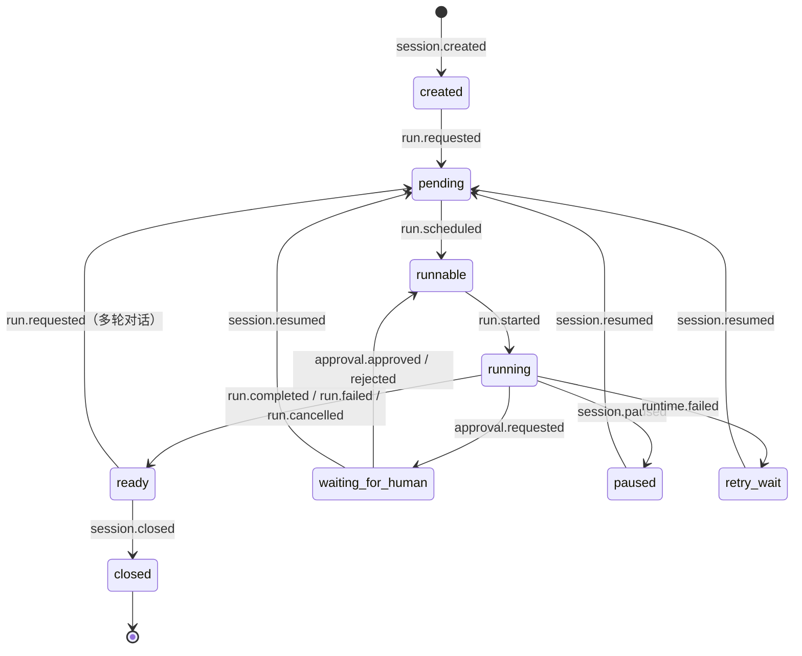
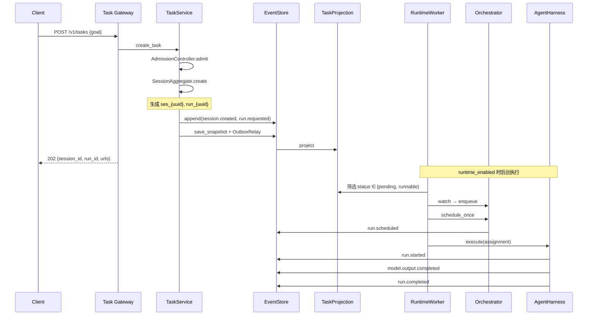
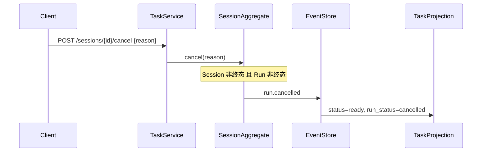
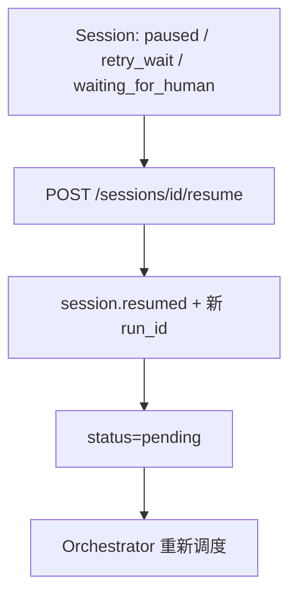
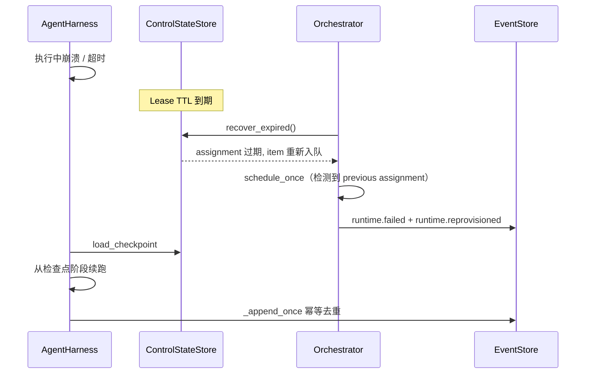

# Session 生命周期梳理

> 基于当前 `src/auraclaw/` 实现整理，与架构文档 `docs/Managed Agent 系统架构/` 对齐。
> 梳理日期：2026-07-21

## 1. 设计原则

| 原则 | 说明 |
|---|---|
| **Canonical Event Log 为唯一事实源** | 所有业务状态由 Session Event 推导；投影、控制态、Runtime 检查点均可丢弃并重建 |
| **Root Session 与 Run 生命周期分离** | `run.completed` / `run.failed` / `run.cancelled` 只结束当前 Run；Root Session 回到 `ready`，可继续多轮对话 |
| **只有 `session.closed` 终结 Session** | Root Session 的终态是 `closed`，而非 Run 的 `completed` |
| **Orchestrator 调度资源，Coordinator 做语义拆分** | 调度、租约、恢复在控制平面；任务拆分在 Collaboration Service |
| **Runtime Event 不保证交付** | `model.output.delta` 等经 SSE 推送，丢失不影响 Canonical 结果 |

Child Session 与 Root 的差异：Run 终态时 Child Session 进入 `completed` / `failed` / `cancelled`，而非 `ready`。

---

## 2. 架构分层

```text
Client
  │
  ▼
Task Gateway (api/routes/tasks.py)
  │  鉴权、幂等、乐观并发
  ▼
TaskCommandGateway → TaskService
  │  聚合根命令、Event Store 写入
  ▼
Event Store + Outbox
  │  原子追加 Canonical Events
  ▼
OutboxRelay → TaskProjection（可重建读模型）
  │
  ├─ TaskQueryService（GET 查询）
  ├─ StreamingGateway（SSE 实时流）
  │
  └─ RuntimeWorker（后台轮询 pending/runnable）
       │
       ├─ ManagedOrchestrator（入队、租约、调度）
       └─ AgentHarness（模型/工具执行、检查点、取消守卫）
```

### 关键模块

| 模块 | 路径 | 职责 |
|---|---|---|
| 聚合根 | `domain/session.py` — `SessionAggregate` | 状态转换、命令校验、事件产出 |
| 应用服务 | `session/task_service.py` — `TaskService` | 创建、消息、取消、恢复、关闭、审批 |
| API | `api/routes/tasks.py` | HTTP 路由 |
| 调度器 | `control/orchestrator.py` — `ManagedOrchestrator` | 队列、租约、Runtime 分配 |
| 执行器 | `runtime/harness.py` — `AgentHarness` | 模型调用、工具执行、检查点续跑 |
| 后台 Worker | `composition/adapters/runtime_worker.py` | 轮询并驱动 Orchestrator + Harness |
| 投影 | `projection/task/projector.py` | Control/Result 读模型 |
| 协作 | `session/collaboration_service.py` | Child DAG（Coordinator 边界，无 HTTP 暴露） |

---

## 3. 状态机

### 3.1 Root Session 状态（`SessionStatus`）



### 3.2 Run 状态（`RunStatus`）

```text
pending → runnable → running → completed | failed | cancelled
running → waiting_for_human | paused | retry_wait
waiting_for_human / paused / retry_wait → runnable（审批通过）或 pending（session.resumed）
```

### 3.3 命令 → 事件映射

| 用户命令 | 聚合根方法 | 产生事件 | 前置条件 |
|---|---|---|---|
| 创建任务 | `create(goal, run_id)` | `session.created`, `run.requested` | Session 不存在 |
| 追加消息 | `append_message(message)` | `user.message.appended` | 非终态 Session |
| 请求新 Run | `request_run(run_id)` | `run.requested` | `created` / `ready` / `paused` |
| 取消 | `cancel(reason)` | `run.cancelled` | 非终态 Session 且 Run 非终态 |
| 恢复 | `resume(run_id)` | `session.resumed` | `paused` / `retry_wait` / `waiting_for_human` |
| 关闭 | `close(reason)` | `session.closed` | 非终态 Session 且 Run 已终态 |
| 审批响应 | `record_human_response(...)` | `human.response.recorded`, `approval.{decision}` | `waiting_for_human` |

---

## 4. Session 创建

### 4.1 端到端流程



### 4.2 创建细节

1. **准入**：`AdmissionController.admit`（当前为 `AllowAllAdmissionController` 占位）
2. **ID 生成**：`session_id = ses_{uuid}`，`run_id = run_{uuid}`
3. **事件写入**：`SessionAggregate.create` 产出 `session.created` + `run.requested`
4. **持久化**：`EventStore.append`（乐观锁 `expected_version` + `command_id` 幂等）→ 保存 Snapshot → `OutboxRelay.relay_once` 刷新投影
5. **响应**：返回 `session_id`、`run_id`、`status_url`、`result_url`、`stream_url`

### 4.3 写命令通用约束

所有写命令要求 HTTP Header：

| Header | 说明 |
|---|---|
| `Idempotency-Key` | 命令幂等键 |
| `X-Tenant-ID` | 租户隔离 |
| `X-Expected-Version` | 乐观并发版本（创建时为 `0`） |

---

## 5. 多轮对话

Root Session 支持在同一 Session 内多次 Run，典型流程：

```text
Run 1 完成（status=ready）
  → POST /sessions/{id}/messages     （user.message.appended）
  → POST /sessions/{id}/runs         （run.requested，新 run_id）
  → Orchestrator 调度 Run 2
  → run.completed → ready
  → … 重复 …
  → POST /sessions/{id}/close        （session.closed，终态）
```

### 对话上下文重建

`AgentHarness._build_messages` 从 Canonical Events 重建 LLM 消息：

| 事件类型 | 映射角色 |
|---|---|
| `session.created` | user（goal） |
| `user.message.appended` | user |
| `model.output.completed` | assistant |

### 查询与轮询

| 端点 | 行为 |
|---|---|
| `GET /v1/tasks/{session_id}` | 状态查询；Run 未完成时 `Retry-After: 2` |
| `GET /v1/tasks/{session_id}?min_version=N` | 投影版本不足时 `202` + `Retry-After: 1` |
| `GET /v1/tasks/{session_id}/result` | 结果查询；未完成时 `202` |
| `GET /v1/streams/{session_id}` | SSE 实时流（`Last-Event-ID` 断点续传） |

SSE 推送的是 **Runtime Event**（如 `model.output.delta`），不保证送达；终态以 Canonical `model.output.completed` / `run.completed` 为准。

---

## 6. 中断（Cancel）

### 6.1 API 取消路径



**聚合根校验**（`SessionAggregate.cancel`）：

- Session 不能在 `completed` / `failed` / `cancelled` / `closed`
- 当前 Run 不能在 `completed` / `failed` / `cancelled`

**Root Session 取消后**：`run_status=cancelled`，`status=ready`（可继续发起新 Run）。

### 6.2 Runtime 运行时取消

执行中的 Run 通过 **Control State Store** 的取消信号中断：

```text
ManagedOrchestrator.cancel(assignment)
  → ControlStateStore.request_cancel(tenant, session, run)
  → Provisioner.cancel(runtime_id)

AgentHarness._guard(assignment)
  → assert_fencing（租约栅栏）
  → is_cancelled → RuntimeCancelledError
```

`_guard` 在以下时机检查取消：模型调用前、工具调用前后、每次 `_append_once` 前。

### 6.3 当前实现缺口

> **取消传播未闭环**

| 路径 | 行为 |
|---|---|
| API `cancel_task` | 仅写入 Canonical `run.cancelled` 事件 |
| `ManagedOrchestrator.cancel` | 调用 `request_cancel`，但 **未与 API 取消路径连接** |

因此：若 Run 正在 Harness 中执行，仅靠 API 取消 **不会** 立即中断 Runtime，除非另有组件将 `run.cancelled` 桥接到 `ControlStateStore.request_cancel`（当前未实现）。

---

## 7. 恢复（Resume / Recovery）

系统中有 **三类恢复**，语义不同：

### 7.1 用户显式恢复（`session.resumed`）



- 入口：`TaskService.resume_task` → `SessionAggregate.resume(run_id)`
- 允许状态：`PAUSED` | `RETRY_WAIT` | `WAITING_FOR_HUMAN`
- 效果：分配新 `run_id`，Session 回到 `pending`，等待 Orchestrator 调度

### 7.2 Runtime 故障自动恢复（租约过期 + 检查点）



**触发**：`ManagedOrchestrator.reconcile` = `recover_expired` + `schedule_once`

**恢复场景事件**：

- 首次调度：`run.scheduled`
- 重新调度：`runtime.failed` + `runtime.reprovisioned`（含新 `fencing_token`）

**检查点阶段**（`AgentHarness`）：

```text
model_pending → model_completed → model_recorded
  → tool_pending → tool_completed
  → approval_waiting（需人工审批时）
  → completed
```

Harness 通过 `_append_once` 对已存在同 identity 的事件去重，保证幂等续跑；通过 `assert_fencing` 防止过期 Runtime 写入。

### 7.3 审批后恢复（非 `session.resumed`）

工具需审批时的流程：

```text
1. Harness 执行工具 → 返回 approval_required
2. 写入 approval.requested + tool.call.denied
3. finish_assignment(waiting_for_human)
4. 用户 POST .../approvals/{id}/responses → approval.approved
5. Session 回到 runnable
6. 同一 assignment 再次 harness.execute，从 approval_waiting 检查点继续同一 tool call
```

此路径 **不分配新 run_id**，而是在同一 Run 内从检查点继续。

---

## 8. Session 关闭

```text
POST /sessions/{id}/close {reason}
  → SessionAggregate.close
  → session.closed
  → status=closed（终态）
```

**前置条件**：

- Session 非终态
- 当前 Run 已处于终态（`completed` / `failed` / `cancelled`）

典型用法：多轮对话结束后显式关闭 Session。

---

## 9. API 端点一览

| 方法 | 路径 | 服务方法 | 说明 |
|---|---|---|---|
| `POST` | `/v1/tasks` | `create_task` | 创建 Root Session + 首个 Run |
| `GET` | `/v1/tasks/{session_id}` | `get_task` | 状态查询 |
| `GET` | `/v1/tasks/{session_id}/result` | `get_result` | 结果查询 |
| `GET` | `/v1/tasks/{session_id}/children` | `list_children` | Child Session 列表 |
| `POST` | `/v1/sessions/{session_id}/messages` | `append_message` | 追加用户消息 |
| `POST` | `/v1/sessions/{session_id}/runs` | `request_run` | 请求新 Run |
| `POST` | `/v1/sessions/{session_id}/cancel` | `cancel_task` | 取消当前活跃 Run |
| `POST` | `/v1/sessions/{session_id}/resume` | `resume_task` | 从暂停/重试/等待人工恢复 |
| `POST` | `/v1/sessions/{session_id}/close` | `close_session` | 显式关闭 Session |
| `POST` | `/v1/sessions/{session_id}/approvals/{approval_id}/responses` | `record_approval_response` | 人工审批 |
| `GET` | `/v1/streams/{session_id}` | `StreamingGateway.sse` | SSE 实时流 |
| `GET` | `/v1/operations/sessions/{session_id}/timeline` | `ObservabilityService.timeline` | 运维时间线 |

---

## 10. 事件类型

### 10.1 用户/命令触发

| 事件 | 触发方 |
|---|---|
| `session.created` | 创建 |
| `user.message.appended` | 追加消息 |
| `run.requested` | 创建 / 请求新 Run / Child 创建 |
| `run.cancelled` | 取消 |
| `session.resumed` | 显式恢复 |
| `session.closed` | 关闭 |
| `human.response.recorded` | 审批记录 |
| `approval.approved` / `approval.rejected` | 审批决策 |

### 10.2 Orchestrator / Runtime 写入

| 事件 | 写入方 | 说明 |
|---|---|---|
| `run.scheduled` | Orchestrator | 首次调度 |
| `run.started` | AgentHarness | Run 开始 |
| `model.output.completed` | AgentHarness | 模型输出（USER 可见） |
| `tool.call.requested` | AgentHarness | 工具调用请求 |
| `tool.call.completed` | AgentHarness | 工具成功 |
| `tool.call.denied` | AgentHarness | 需审批时拒绝 |
| `approval.requested` | AgentHarness | 等待人工 |
| `run.completed` | AgentHarness | Run 完成 |
| `runtime.failed` | Orchestrator | 租约过期 / 重调度 |
| `runtime.reprovisioned` | Orchestrator | 新 Runtime 接管 |

### 10.3 Runtime Event（非 Canonical）

| 类型 | 通道 | 说明 |
|---|---|---|
| `model.output.delta` | Runtime Event Bus → SSE | 流式 token，不保证交付 |

### 10.4 结果投递触发

以下 Canonical 事件触发 Result Delivery Outbox：`run.completed`、`run.failed`、`run.cancelled`、`approval.requested`、`child.result_published`。

---

## 11. 持久化与一致性

### 11.1 命令写入路径

```text
Command
  → SessionAggregate（内存状态转换 + 产出 NewEvent）
  → EventStore.append（expected_version 乐观锁 + command_id 幂等）
  → 同事务：Canonical Events + Outbox Records
  → save_snapshot
  → OutboxRelay.relay_once → TaskProjection
```

### 11.2 聚合加载

`TaskService._load`：

1. 读 Snapshot → `SessionAggregate.from_snapshot`
2. 从 `aggregate_version + 1` 重放后续事件
3. 无 Snapshot 则 `from_events` 全量重放

Legacy Snapshot 兼容：多 Run 改造前，Root Session 的 `completed`/`failed`/`cancelled` 在恢复时翻译为 `ready`。

---

## 12. RuntimeWorker 主循环

`RuntimeWorker.run_once`（`composition/adapters/runtime_worker.py`）：

1. 扫描 Event Store 中所有 session
2. 从 Task Projection 筛选 `status ∈ {pending, runnable}`
3. `ManagedOrchestrator.watch` → 入队 RunnableItem
4. 循环 `schedule_once` → 获取租约 → Provision Runtime → 写调度事件
5. `AgentHarness.execute` → 写 Runtime 生命周期事件
6. `relay_once` 刷新投影

应用启动：`composition/api.py` lifespan 在 `runtime_enabled && model_gateway_configured` 时启动 `RuntimeWorker`。

---

## 13. 相关测试

| 测试文件 | 覆盖场景 |
|---|---|
| `tests/integration/test_task_api.py` | 创建、取消、关闭、幂等、消息追加、审批 |
| `tests/unit/test_session_aggregate.py` | 状态机、多轮、Legacy Snapshot 迁移 |
| `tests/unit/test_m2_managed_runtime.py` | Orchestrator 竞争、Fencing、Runtime 恢复、Stream 失败不影响 Canonical |
| `tests/unit/test_m3_tool_security.py` | 审批后恢复、工具取消 |
| `tests/integration/test_postgres_m4.py` | Collaboration DAG + Postgres 投影 |

---

## 14. 待完善项

| 项 | 现状 |
|---|---|
| 取消传播 | API `cancel_task` 与 `ControlStateStore.request_cancel` 未桥接 |
| `session.paused` / `run.retry_scheduled` | 聚合 `apply` 已支持，但 `TaskService` 无对应命令入口 |
| Collaboration HTTP API | Child DAG 操作仅在服务层/测试中调用 |
| Admission | `AllowAllAdmissionController` 占位，无配额/速率限制 |

---

## 15. 参考文档

- [Managed Agent 系统架构总览](./Managed%20Agent%20系统架构/00%20Managed%20Agent%20系统架构总览.md)
- [Session Collaboration Service](./Managed%20Agent%20系统架构/02%20Session%20Collaboration%20Service.md)
- [Orchestrator](./Managed%20Agent%20系统架构/09%20Orchestrator.md)
- [Shared Event and State Contracts](./Managed%20Agent%20系统架构/22%20Shared%20Event%20and%20State%20Contracts.md)
- [架构代码梳理](./Managed%20Agent%20架构代码梳理.md)
