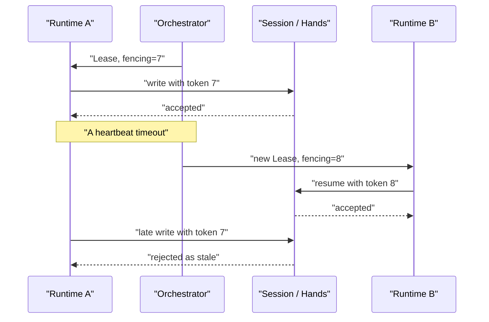
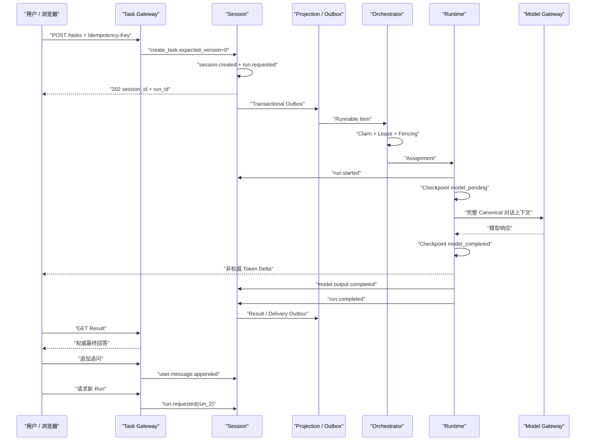

# 对话执行与恢复机制

## 1. 核心结论

AuraClaw 中一次“发起对话”并不只是发送一条 HTTP 消息，而是把用户意图转换为：

1. 可持久化的 Session 事实；
2. 可调度的 Run；
3. 具有唯一执行权的 Runtime Assignment；
4. 可从 Checkpoint 恢复的执行过程；
5. 可通过 Result API 重新查询的权威结果。

理解这套机制最重要的一句话是：

> 一个对话是长期存在的 Session；每次模型回答是一次 Run；真正执行它的是可随时替换的 Runtime。

```text
Session：整段对话
├── Run 1：第一次提问和回答
├── Run 2：第一次追问和回答
└── Run 3：第二次追问和回答

Runtime A 执行 Run 1
Runtime B 可以接管 Run 1
Runtime C 可以执行 Run 2
```

三个对象不能混为一谈：

```text
Session ≠ Run ≠ Runtime
```

---

## 2. 三个核心身份

### 2.1 Session：对话的长期身份

`session_id` 标识整段对话，其中包含：

- 第一轮问题；
- 后续用户消息；
- 每一轮模型最终回答；
- 工具调用与结果；
- 人工审批；
- 所有 Run 的生命周期。

Root Session 只有显式产生 `session.closed` 后才真正终止。

### 2.2 Run：一次回答任务

`run_id` 标识某一轮执行。同一个 Session 可以有多个 Run：

```text
ses_123
  run_001  第一轮
  run_002  第二轮
  run_003  第三轮
```

Run 可以完成、失败或取消，但 Root Run 的终态不会关闭 Session。一次 Root Run 结束后：

```text
Session status = ready
Run status     = completed | failed | cancelled
```

### 2.3 Runtime：临时执行实例

Runtime 是调用模型、工具和 Skill 的计算实例。它不拥有对话，只在 Lease 有效期间获得某个
Run 的执行权。

Runtime 可以正常完成，也可以崩溃、超时、被回收或被另一实例替代。任务可靠性不能依赖
某个 Runtime 一直存活。

---

## 3. 第一次发起对话

前端第一次发送问题时调用：

```http
POST /v1/tasks
Idempotency-Key: create-task-xxx

{
  "goal": "用户的问题"
}
```

服务端同时生成：

```text
session_id = ses_xxx
run_id     = run_xxx
```

领域对象产生两个 Canonical Events：

```text
session.created
run.requested
```

它们表达两个不同事实：

- `session.created`：长期对话已经存在；
- `run.requested`：该对话现在有一轮需要执行。

### 3.1 原子提交

生产 Event Store 在同一数据库事务中写入：

```text
Canonical Events
Command Dedup Result
Session Head Version
Projection Outbox
Control Outbox
```

因此不会出现“Session 创建成功但调度消息丢失”，也不会出现“调度消息已发出但 Session
没有创建成功”。

`202 Accepted` 的准确含义是：

> 系统已经可靠接纳任务并记录执行意图，但模型回答尚未完成。

---

## 4. 客户端不确定性与命令幂等

创建请求必须携带 `Idempotency-Key`。命令去重范围是：

```text
tenant_id + operation + command_id
```

如果第一次请求实际已经成功，只是 HTTP 响应在网络中丢失，客户端使用相同 Key 重试时，
服务端返回第一次保存的 `session_id` 和 `run_id`，不会创建第二个 Session。

该机制解决的是：

> 客户端无法确定请求是否成功时，如何安全重试。

同一命令的重试必须复用原 Key。如果客户端每次重试都生成新 Key，服务端会把它们视为不同命令。

---

## 5. 从持久事实进入执行队列

`run.requested` 与 Control Outbox 在同一事务提交。异步链路为：

```text
run.requested
  -> Control Outbox
  -> Runnable Feed
  -> Control Queue
  -> Orchestrator Claim
```

即使 Projection Worker 或 Control Consumer 当场崩溃，Outbox 记录仍然存在，恢复后可以继续消费。

消费过程使用：

- claim；
- visibility timeout；
- ack/nack；
- 稳定 task ID；
- 幂等 enqueue。

一个 Run 的 task ID 是：

```text
tenant_id:session_id:run_id
```

重复投递不会产生两个不同的执行任务。

---

## 6. 唯一执行权：Lease 与 Fencing Token

Orchestrator 原子 Claim Runnable Item 后获取：

```text
Lease
Fencing Token
Assignment
```

Assignment 至少包含：

```text
tenant_id
session_id
run_id
runtime_id
lease_id
fencing_token
budget
deadline
role
```

### 6.1 Lease

Lease 表示：

> 在有限时间内，这个 Runtime 拥有当前 Session 的执行权。

Runtime 必须持续 Heartbeat 续租。Lease 到期后，Orchestrator 可以重新调度。

### 6.2 Fencing Token

每次接管都会获得单调递增的 Fencing Token：

```text
Runtime A：token 7
Runtime B：token 8
```

假设 Runtime A 网络中断，Lease 过期，Runtime B 接管。A 恢复后即使不知道自己已经失效，
Session 和 Hands 仍会拒绝 token 7：

```text
A 使用 token 7 写入 -> 拒绝
B 使用 token 8 写入 -> 接受
```

Lease 解决“所有权会过期”；Fencing Token 解决“旧所有者不知道自己已失效，仍然继续写”的问题。



---

## 7. Runtime 执行流程

Runtime 得到 Assignment 后：

1. 验证 Fencing Token；
2. 检查取消状态和 Deadline；
3. 加载 Session Canonical Events；
4. 幂等追加 `run.started`；
5. 检查当前 Run 是否已经完成；
6. 加载 Runtime Checkpoint；
7. 构造模型上下文；
8. 调用模型与受管能力；
9. 写入完整模型输出；
10. 写入 `run.completed`；
11. 完成 Assignment。

Runtime 写事实时使用稳定 Command ID，例如：

```text
runtime:run.started:<run_id>
runtime:model.output.completed:<model_call_id>
runtime:run.completed:<run_id>
```

新 Runtime 恢复后再次尝试写同一事实时，Session Store 返回第一次命令的结果，不会追加重复事件。

---

## 8. 多轮对话上下文

Runtime 不依赖浏览器回传完整历史，也不依赖进程内聊天数组。模型上下文按 Canonical Event
顺序重建：

```text
session.created         -> user
user.message.appended   -> user
model.output.completed  -> assistant
```

例如：

```text
session.created("你好")
model.output.completed("你好，有什么可以帮你？")     run_1
user.message.appended("继续解释恢复机制")
model.output.completed("恢复机制包括……")             run_2
user.message.appended("那 Fencing 呢？")
```

第三轮模型看到：

```text
user: 你好
assistant: 你好，有什么可以帮你？
user: 继续解释恢复机制
assistant: 恢复机制包括……
user: 那 Fencing 呢？
```

因此，对话历史的权威来源在服务端 Canonical Event Log，而不是浏览器本地状态。

---

## 9. 第二轮追问

第一轮完成后：

```text
Session = ready
Run 1   = completed
```

用户追问时，前端分两步提交：

```text
1. POST /sessions/{session_id}/messages
2. POST /sessions/{session_id}/runs
```

第一步产生：

```text
user.message.appended
```

第二步生成新的 `run_id`，并产生：

```text
run.requested
```

系统保持同一个 `session_id`：

```text
Session = pending
Run 2   = pending
```

Run 2 完成后：

```text
Session = ready
Run 2   = completed
```

之后可以继续创建 Run 3、Run 4。只有显式 `session.closed` 才禁止继续追加消息和请求新 Run。

---

## 10. 并发控制与 Projection Lag

追加消息和请求新 Run 都必须携带：

```http
X-Expected-Version: 12
```

它表示：

> 该命令基于 Session 第 12 版状态产生。

如果另一个请求已经追加事件，真实版本变成 13，本次写入会被拒绝：

```text
expected 12, actual 13 -> VersionConflict
```

这可以防止：

- 两个浏览器同时发起新 Run；
- 审批与取消并发覆盖；
- 前端基于旧状态修改 Session；
- 多个 Coordinator 同时修改 DAG。

### 10.1 Projection Lag 竞态

前端读取的是异步 Projection，其版本可能暂时落后于 Session Head。追问时可能发生：

1. 前端用版本 12 追加消息；
2. Session Head 成功变成 13；
3. Projection 暂时仍显示 12；
4. 前端马上用版本 12 请求新 Run；
5. Session 正确拒绝该请求。

当前前端使用：

```text
runVersion = max(
    最新 projection_version,
    append 前版本 + 1
)
```

这样即使 Projection 尚未追上，也不会在追加消息后倒退到旧版本。

---

## 11. Runtime 崩溃恢复

恢复依赖三层证据：

```text
Canonical Event：业务上已经发生了什么
Checkpoint：Runtime 执行到了哪一步
Invocation Store：外部工具副作用发生到什么程度
```

### 11.1 模型调用前崩溃

Checkpoint：

```text
model_pending
```

新 Runtime 接管后重新进入模型调用。

### 11.2 模型完成后崩溃

完整响应先保存到 Checkpoint：

```text
model_completed
response = 完整模型响应
```

新 Runtime 直接使用 Checkpoint 中的响应，不重新调用模型。

### 11.3 模型结果已经写入 Session 后崩溃

Canonical Event 已包含：

```text
model.output.completed
```

稳定 Command ID 会阻止重复追加。

### 11.4 `run.completed` 后、Assignment 完成前崩溃

新 Runtime 启动时检查当前 `run_id` 是否已有 `run.completed`。如果存在，只完成控制侧
Assignment，不重新执行。

### 11.5 工具执行后崩溃

最危险的故障窗口是：

```text
外部动作已经成功
Runtime 尚未写回 Session
```

系统通过以下证据恢复：

- 稳定 `tool_invocation_id`；
- Tool Idempotency Key；
- Hands Invocation Store；
- `capability.call_completed` Checkpoint；
- 副作用状态；
- 待补写 Side Events。

新 Runtime 先补写 Tool 和 Side Events，再继续下一轮，不重新调用工具。

如果外部系统无法确认是否执行成功，必须记录：

```text
side_effect_status = unknown
```

此时不能盲目重试，需要查询、补偿或人工判断。

### 11.6 模型调用的模糊边界

如果 Model Provider 已完成推理，但响应在进入 Checkpoint 前丢失，模型调用可能被重新发起，
产生额外 Token 或费用。模型推理通常没有外部业务副作用，因此可以接受受控重试；外部写工具
必须使用更强的 Invocation Store 和幂等边界。

---

## 12. 人工审批恢复

工具需要审批时：

```text
approval.requested
Session = waiting_for_human
Run     = waiting_for_human
```

Runtime 保存：

```text
原 tool_invocation_id
原参数
原 idempotency key
Checkpoint
```

当前执行 Assignment 可以释放，但 Run 不会被标记为完成。

用户响应必须经过：

```text
Web
 -> Task Gateway
 -> Session
 -> human.response.recorded
 -> approval.approved / rejected
```

批准后任务重新成为 runnable，Runtime 使用原调用身份继续执行。审批等待不是新对话，也不能
丢失原工具调用。

---

## 13. 浏览器断线与权威结果

浏览器主要消费 Runtime Event：

```text
model.output.delta
progress
typing
approval notification
```

这些是非权威实时信号。权威状态来自：

```text
GET /v1/tasks/{session_id}
GET /v1/tasks/{session_id}/result
GET /v1/tasks/{session_id}/transcript
```

因此：

- SSE 断线不会取消 Run；
- 浏览器关闭不会取消 Session；
- Token Delta 丢失不会丢失完整回答；
- 重连可以携带 `Last-Event-ID` 请求回放；
- 游标过期时不伪造缺失内容，而是回到 Task/Result；
- 最终页面用 Result 修正流式回答。

Streaming 解决“现在看到了什么”，Result 解决“最终答案是什么”。

---

## 14. 历史对话缺陷与修复

### 14.1 Session 与 Run 生命周期混淆

旧机制：

```text
Run 完成 -> Session completed
```

用户第二次追问时，系统认为 Session 已终止，只能创建新对话。

修复后：

```text
Root Run 完成 -> Session ready
显式 close   -> Session closed
```

这是多轮对话修复的基础。

### 14.2 前端使用 Session Status 判断回答完成

旧前端轮询 `task.status`，多轮模型下应该轮询 `task.run_status`。Session 可以处于 `ready`，
同时最新 Run 已经是 `completed`、`failed` 或 `cancelled`。

### 14.3 恢复历史时只显示 Goal 和最新结果

旧恢复逻辑只能得到第一条问题和最后一条回答，中间追问全部消失。

后来先改为从 Timeline 重建，再增加专用 Transcript API，只读取：

```text
session.created
user.message.appended
model.output.completed
approval events
```

这样既能恢复完整多轮对话，又不需要加载完整观测 Timeline。

### 14.4 上一轮 SSE 尾部串入下一轮回答

同一 Session 的 SSE 可能回放 Run 1 的迟到 Delta。旧前端按“最后一个正在流式输出的
assistant”合并，导致 Run 1 尾部被追加到 Run 2。

现在每个回答气泡按 `run_id` 隔离，并维护已完成 Run 集合。已完成 Run 的迟到 Delta 会被丢弃。

### 14.5 Result 与 SSE 竞态覆盖上一轮回答

可能出现：

```text
用户已发出第二轮问题
Run 2 Result 已完成
Run 2 SSE 气泡尚未创建
```

旧逻辑可能把“最后一个 assistant”即 Run 1 改写成 Run 2 的答案。

现在 Result 只能：

- 更新相同 `run_id` 的气泡；
- 更新位于最新用户消息之后的临时气泡；
- 否则创建新的回答气泡。

### 14.6 新 Run 命中上一轮 Result ETag

开始追问后，如果前端保留旧 Result 和 ETag，可能收到 304 并误用上一轮结果。

现在请求新 Run 时清空：

```text
Result State
Result ETag
Chat Result
```

同时 `run.requested` 会在 Projection 中清空上一轮最新结果字段。

### 14.7 旧 Run Delivery 覆盖当前 Run

上一轮 Delivery 事件可能在下一轮开始后才到达。Projection 会验证：

```text
delivery_event.run_id == current_view.run_id
```

不匹配的旧 Run Delivery 不会覆盖当前 Run 状态。

---

## 15. 完整时序



---

## 16. 故障与防护机制对照

| 问题 | 防护机制 |
|---|---|
| 客户端不知道请求是否成功 | Idempotency Key |
| 多个请求并发修改 Session | `expected_version` |
| 事件已写入但调度消息丢失 | Transactional Outbox |
| Outbox 重复投递 | 稳定 task ID + 幂等 Queue |
| 两个调度器竞争一个任务 | 原子 Claim |
| 旧 Runtime 恢复后继续写 | Lease + Fencing Token |
| Runtime 执行中崩溃 | Canonical Event + Checkpoint |
| 工具产生重复副作用 | Invocation Store + Tool Idempotency |
| SSE 断线或丢失 | Cursor Replay + Result 对账 |
| 多 Run 的 SSE 相互串流 | `run_id` 隔离 |
| 页面重开后历史丢失 | Transcript API + Canonical Event |
| Projection 暂时落后 | `min_version` / Retry + 版本保护 |
| 旧 Run 结果污染新 Run | Result 清理 + `run_id` 校验 |

---

## 17. 必须保持的核心不变量

1. 一个 Session 可以包含多个 Run。
2. 每一轮执行必须拥有独立 `run_id`。
3. Root Run 结束后 Session 回到 `ready`，不会自动关闭。
4. 对话历史来自 Canonical Event，而不是浏览器内存。
5. 同一个 Run 同时只能有一个有效 Fencing Token 持有者。
6. Runtime 可以替换，业务完成事实和工具副作用证据不能丢失。
7. Checkpoint 是恢复控制状态，不能替代 Canonical Event。
8. Runtime Event 提供实时体验，Result 才是最终回答。
9. 新 Run 必须清理上一轮最新结果视图，但不能删除历史事实。
10. 旧 Run 的 Delta、Result 或 Delivery 不能覆盖当前 Run。

最终可以把整套机制概括为：

> 发起对话之所以最终可以执行和恢复，不是因为某个 Agent 进程一直活着，而是因为执行意图、
> 对话历史、执行所有权、恢复位置和最终结果分别被持久化，并通过幂等、版本、Outbox、Lease、
> Fencing 和 Checkpoint 连接成一条闭环。

---

## 18. 对应实现

- `src/auraclaw/domain/session.py`：Session/Run 状态机。
- `src/auraclaw/session/task_service.py`：创建、追加消息、请求 Run、恢复和关闭。
- `src/auraclaw/infrastructure/persistence/*_event_store.py`：命令幂等、版本控制、Canonical Event 与 Transactional Outbox。
- `src/auraclaw/control/runnable_feed.py`：从 Session 事实生成 Runnable Item。
- `src/auraclaw/control/orchestrator.py`：Claim、Lease、Fencing 和 Assignment。
- `src/auraclaw/runtime/harness.py`：执行、Checkpoint、模型/工具恢复与终态写入。
- `src/auraclaw/projection/task/projector.py`：Session/Run 查询视图和结果隔离。
- `src/auraclaw/gateways/query/transcript.py`：从 Canonical Event 重建聊天记录。
- `frontend/app/lib/protocol.mjs`：按 Run 合并 SSE、Result 对账和历史恢复。
- `frontend/app/workspace.tsx`：多轮发送、轮询、重连、审批和恢复交互。

