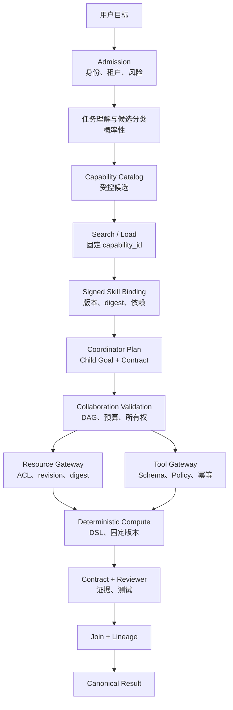

# 任务正确性与完整执行保证

## 1. 核心结论

讨论 Agent 系统“是否正确”时，首先必须把正确性拆开。否则很容易把系统可靠性、模型判断、
数据真实性、工具副作用和业务计算混成一个无法验证的承诺。

AuraClaw 面对的完整问题链是：

```text
用户意图
  -> 任务理解与分类
  -> 计划与语义拆分
  -> 数据选择与读取
  -> 工具选择与调用
  -> 业务计算
  -> 结果验证与汇总
  -> 长程执行与交付
```

任一环节出错，都可能得到错误结果。因此：

> 正确结果不是由一个强模型直接保证的，而是由概率性判断、确定性约束、来源证据、独立验证和
> 可恢复执行共同收敛出来的。

同时必须明确：

> 系统可以强保证“按照规则执行”，但不能仅凭基础设施保证“模型对世界的理解一定正确”。

AuraClaw 当前能够强保证的主要是：

- 租户、权限和角色边界；
- 版本、Schema 和状态转换；
- 命令与工具调用幂等；
- 唯一执行权和旧 Runtime 隔离；
- 长程步骤恢复；
- 固定 Skill、Tool 和 Resource 绑定；
- 数据来源、版本和摘要证据；
- 结果结构、评审证据和 lineage；
- 失败显式化，不把未知状态伪装成成功。

仍然属于概率性或尚待建设的部分包括：

- 对开放自然语言任务的语义分类；
- 计划是否完整覆盖用户所有隐含要求；
- 外部数据源本身是否真实、完整和最新；
- Reviewer 是否识别出所有语义错误；
- 尚未接入确定性计算器的业务公式结果。

---

## 2. 正确性的七个层次

| 层次 | 核心问题 | 主要保证方式 |
|---|---|---|
| 意图/分类正确性 | 系统是否理解用户真正要做什么？ | 候选约束、Skill 适用条件、置信度与评测 |
| 计划正确性 | 子任务是否完整、依赖是否合理？ | Coordinator + DAG 规则 + Output Contract |
| 执行正确性 | 是否按选定计划、版本和权限执行？ | Binding、Schema、Policy、Lease/Fencing |
| 长程完整性 | 中断后能否继续，步骤是否漏失或重复？ | Canonical Event、Checkpoint、Invocation Store |
| 数据正确性 | 数据是否来自正确来源和版本？ | ACL、Resource、revision、digest、lineage |
| 工具/计算正确性 | 是否调用正确工具并按确定规则计算？ | Tool Contract、幂等、确定性 DSL/执行器 |
| 结果正确性 | 输出是否满足要求并有足够证据？ | Output Contract、Reviewer、测试、Join |

这七层不是互相替代的。例如：

- Fencing 可以保证没有两个 Runtime 同时写，但不能保证模型选对了工具；
- Schema 可以保证参数类型正确，但不能保证业务目标正确；
- Reviewer 可以发现问题，但 Reviewer 本身也可能判断错误；
- 数据有 digest 只能证明“用的是这份数据”，不能证明源数据没有错误。

---

## 3. 三种不同等级的保证

理解 AuraClaw 时，可以把机制分为三个保证等级。

### 3.1 硬保证：违反就拒绝

由确定性代码、数据库约束和状态机实施：

```text
tenant 不匹配              -> 拒绝
expected_version 不匹配    -> 拒绝
Fencing Token 过期         -> 拒绝
Tool 未加载                -> 拒绝
输入 Schema 不合法         -> 拒绝
高风险动作无审批           -> 拒绝
Skill digest 不匹配        -> 拒绝
DAG 有环                   -> 拒绝
Output Contract 缺字段     -> 拒绝
Reviewer 无证据            -> 拒绝
```

这些属于系统可以明确声明的保证。

### 3.2 可验证保证：保留证据，允许复核

系统不能直接证明内容真实，但可以保证结果可追溯：

```text
Resource URI
source revision
content digest
retrieved_at
classification
Policy decision
Tool version
Skill package digest
model version
Artifact lineage
Review evidence
```

这些证据支持重放、审计、对账和事后定位。

### 3.3 概率性保证：需要评测和兜底

以下判断无法仅靠类型系统或数据库证明：

- 用户表达的真实意图；
- 任务属于哪个业务类别；
- 是否应该拆成这些子任务；
- 哪个候选 Skill 最适用；
- 外部事实之间如何解释；
- 最终自然语言结论是否合理。

它们需要：

- 模型；
- 明确的候选空间；
- 置信度；
- 离线评测集；
- Reviewer；
- 低置信度澄清或人工介入。

---

## 4. 任务分类如何工作

### 4.1 当前没有一个全能的“任务分类器”

AuraClaw 当前不是先调用一个中心分类模型，把所有任务永久归到某个类别。普通任务可以直接回答，
需要外部能力时进入 Capability-Aware Loop：

```text
Model
  -> capabilities.search
  -> capabilities.load
  -> Tool / Resource / Skill
  -> Next Model Turn
```

分类在这里表现为“模型决定是否需要能力，以及搜索什么候选”，而不是一个单独的标签。

### 4.2 Catalog 先缩小合法候选空间

Capability Catalog 中每个能力包含：

```text
capability_id
kind
canonical_name
version
title / description / tags
tenant scope
trust level
classification
permission
risk level
status
source revision
content digest
```

模型搜索前，平台已经过滤：

- tenant；
- Server 是否启用；
- Capability 是否 active/degraded；
- kind；
- permission；
- 可见范围。

因此模型不是从所有远端能力中任意选择，而是在策略可见的受管候选集合中选择。

### 4.3 当前搜索实现的真实边界

当前代码使用对 `canonical_name`、`title`、`tags` 和 `description` 的关键词打分：

```text
name 命中        +8
title 命中       +5
tag 精确命中     +3
description 命中 +1
```

这能实现稳定、可解释的初始检索，但它不是完整的语义分类器，也没有从代码层实现架构文档中规划的：

- Embedding 或语义相似度；
- 历史成功率；
- 依赖可满足性综合评分；
- 任务分类置信度；
- 自动低置信度澄清。

因此当前不能声称“任务分类一定正确”。

### 4.4 `applies_when` 与 `not_when`

Skill Manifest 可以声明：

```text
applies_when
not_when
```

它们帮助模型判断适用性，并进入 Capability 的描述和标签。但当前 Skill Resolver 强制执行的主要是：

- Skill 版本是否 active；
- publisher/name/version；
- Runtime Role 是否允许；
- Tool/Resource 依赖是否存在；
- Policy 是否允许；
- package digest 是否一致。

`applies_when` 和 `not_when` 目前主要是模型可见的语义指引，不是一个完整的确定性规则引擎。

这意味着：

> 系统可以阻止激活非法 Skill，但不能完全阻止模型激活“合法但语义上不合适”的 Skill。

### 4.5 如何把分类正确性继续提高

需要在当前 Catalog 和 Skill Contract 之上增加：

1. 结构化 Task Taxonomy；
2. 明确的业务对象、动作、风险、时效和输出类型；
3. 规则优先的确定性路由；
4. 模型分类器及校准置信度；
5. Top-K 候选和冲突检测；
6. 低置信度时向用户澄清；
7. 分类 golden set 与持续回归评测；
8. 错误分类反馈回流；
9. `applies_when/not_when` 的机器可执行规则；
10. 高风险类别的人工确认。

---

## 5. 能力选择为什么采用“搜索—加载—调用”

模型初始只看到固定控制能力：

```text
auraclaw.capabilities.search
auraclaw.capabilities.load
auraclaw.skills.activate
auraclaw.resources.read
```

而不是一次性看到所有业务工具。

### 5.1 搜索

模型提交自然语言 query，只获得有限候选摘要和稳定 `capability_id`。

搜索有硬上限：

- 搜索次数；
- 候选数量；
- 返回种类；
- Schema 总大小；
- 每次加载数量。

### 5.2 加载

模型只能加载当前 Run 搜索结果中出现过的 `capability_id`。伪造任意 ID 不会加载成功。

加载后 Runtime 得到平台生成的权威契约，而不是相信模型自己描述的 Tool Schema。

### 5.3 调用

业务 Tool 只有在被加载后才进入 `ModelRequest.tools`。模型即使直接伪造一个未加载 Tool Call，
也会得到：

```text
capability_not_loaded
```

这一设计降低了：

- 上下文噪声；
- 错工具概率；
- 任意工具伪造；
- 版本不明确；
- 过度授权。

但仍需注意：它缩小了模型的犯错空间，不等于证明模型一定选中了最佳能力。

---

## 6. Skill 如何把“正确流程”固定下来

Skill 不是单个 Prompt，也不是一个 Tool。它描述：

- 适用与禁止条件；
- 输入输出 Schema；
- 必需 Tool；
- 必需 Resource；
- 允许的 Runtime Role；
- 数据分类与风险；
- 最大步骤和超时；
- 完整执行说明。

### 6.1 发布前

Skill Package 必须：

- Manifest 合法；
- 路径安全；
- 文件数量和大小受限；
- publisher 签名有效；
- package digest 一致；
- 同 publisher/name/version 不可覆盖内容。

### 6.2 激活时固定 Binding

Resolver 固定：

```text
skill name/version/publisher
package digest
artifact ref
Tool capability id/version/schema digest
Resource capability id/content digest
Policy version/decision
max steps
timeout
```

一个 Run 内 Catalog 即使发生更新，当前 Binding 也不能静默漂移。

### 6.3 Skill 能保证什么

Skill 可以保证：

- 执行的是哪一版流程；
- 依赖的是哪一版能力；
- 允许哪些角色激活；
- 最大运行范围；
- 恢复后仍使用同一 Binding；
- 历史结果可以追溯到 package digest。

Skill 不能自动保证：

- 流程本身设计无误；
- 模型每一步语义判断都正确；
- Tool 或数据源内部没有业务缺陷。

因此 Skill 还需要版本评审、测试 fixtures、健康探针和线上质量指标。

---

## 7. 任务计划与多 Agent 拆分

### 7.1 Coordinator 负责语义计划

Coordinator 判断：

- 是否需要拆分；
- Child Goal 是什么；
- 子任务之间有什么依赖；
- 使用 Worker、Reviewer 还是 Repair；
- 如何 Join。

这些决策仍然具有概率性。

### 7.2 Collaboration Service 强制结构正确

Coordinator 不能直接写 DAG，只能通过 Collaboration Service。服务强制：

- 同 tenant 和 Root；
- DAG 无环；
- 不能自依赖；
- 依赖必须存在；
- 深度、宽度和 Child 数量受限；
- 总预算受限；
- 稳定 `task_key` 不允许同 Key 更换规格；
- 只有依赖完成的 Child 才能 runnable。

因此系统可以保证 DAG 结构合法，但不能仅凭这些规则保证 DAG 在语义上完整。

例如，用户要求“设计、实现、测试并发布”，Coordinator 只创建“实现”子任务时，DAG 仍可能在
结构上完全合法，却遗漏业务要求。

### 7.3 计划完整性的提高方式

需要通过：

- Root Output Contract；
- 需求分解检查表；
- Requirement-to-Child 覆盖矩阵；
- Coordinator 自检；
- 独立 Planner/Reviewer；
- 缺失要求检测；
- Join 前覆盖率校验；
- 用户确认关键计划；

把“结构合法”推进到“语义覆盖完整”。

当前代码已经有 Child Output Contract 和 Reviewer 证据，但完整的 Requirement Coverage
仍然是可以继续增强的方向。

---

## 8. 长程任务如何保证完整执行

长程完整执行不是指“任务一定成功”，而是指：

> 任务不会因为进程中断而静默丢失；每个已完成步骤有证据，未完成、失败、取消和未知状态都能
> 被明确识别，并从正确位置继续。

### 8.1 三层状态

```text
Canonical Event：业务上发生了什么
Checkpoint：Runtime 执行到了哪里
Invocation Store：外部副作用到了什么状态
```

### 8.2 Skill Step Cursor

Skill Runner 为每一步保存：

```text
skill_activation_id
skill_binding
skill_step_cursor
skill_steps_completed
step result
```

每步必须返回非空 `next_cursor`；未完成步骤不能返回相同 cursor，否则执行失败。这样可以避免
一个步骤无限原地循环却被误认为取得进展。

### 8.3 步骤完成顺序

典型顺序是：

```text
执行步骤
  -> 保存 Checkpoint
  -> 发布非权威进度
  -> 写 Skill/Tool Canonical Event
  -> 进入下一步
```

进程在 Checkpoint 后死亡时，新 Runtime 从 cursor 继续，不重新执行已完成步骤。

### 8.4 完整性保护

- Lease/Fencing：旧 Runtime 不能继续推进；
- 固定 Binding：恢复后不换 Skill/Tool/Resource 版本；
- 稳定 invocation id：工具调用不会失去身份；
- Budget：限制最大步骤、Token、Cost；
- Deadline：防止永久运行；
- 重复调用检测：连续无进展调用停止；
- Terminal Event：明确 completed/failed/cancelled；
- Canonical Result：不能用 Runtime Event 代替完成事实。

### 8.5 “完整执行”不等于“无限重试直到成功”

以下情况应明确失败或等待人工，而不是伪装成完整：

- 输入缺失；
- 数据源不可用超过策略；
- 外部副作用状态未知；
- Budget 耗尽；
- Deadline 到期；
- 依赖无法满足；
- Review 不通过；
- Policy 拒绝；
- Skill 被撤销；
- 确定性计算器无法解析公式。

失败是一个正确结果；静默跳过步骤并返回成功才是不完整。

---

## 9. 数据如何被正确获取

### 9.1 Runtime 不接受任意 URL

Runtime 只能读取已加载 Resource 或 Resource Template：

- URI Scheme 必须允许；
- Resource 必须在 tenant Catalog 中注册；
- Template 参数集合必须与字段完全一致；
- 模型不能自行提交任意 HTTP URL。

### 9.2 读取前控制

```text
trusted tenant/session/run
  -> Resource Registry
  -> URI scheme
  -> ACL
  -> Policy
  -> classification
  -> MIME/size limit
  -> Secret/DLP scan
  -> Prompt Injection scan
  -> inline or Artifact
```

### 9.3 来源证据

Resource 返回并记录：

```text
capability_id
URI
source revision
content digest
classification
retrieved_at
Policy decision id
security findings
Artifact ref
```

当数据真正用于推理时，Runtime 追加：

```text
context.resource.used
```

这使结果能够回答“用了哪一份数据”。

### 9.4 Prompt Injection

Resource 即使已通过 ACL，正文仍然是不可信数据。检测到 Prompt Injection finding 后，
Runtime Context Policy 会 withheld 正文，只保留安全证据，不把恶意指令注入模型。

### 9.5 数据正确性的边界

上述机制可以保证：

- 读取了受权来源；
- 使用了指定版本；
- 内容传输后 digest 可验证；
- 数据未被静默替换；
- 结果可追溯到来源。

它不能证明：

- 源数据库中的业务数据没有录错；
- 上游数据已及时更新；
- 缺失记录一定能被发现；
- 来源之间没有逻辑冲突。

要进一步保证业务数据质量，还需要：

- Source Contract；
- freshness SLA；
- 完整性和唯一性检查；
- 行数/金额/主键对账；
- 多源 reconciliation；
- 异常和缺失率门禁；
- 数据质量报告。

---

## 10. 工具如何被正确调用

Tool Gateway 对一次调用依次执行：

```text
Loaded Capability
  -> exact name/version
  -> input JSON Schema
  -> action digest
  -> idempotency / Invocation Store
  -> Policy
  -> Approval
  -> Credential Proxy / Sandbox
  -> timeout / cancellation
  -> output JSON Schema
  -> redaction
  -> Artifact extraction
  -> Tool Result
```

### 10.1 防止调用不存在或错误版本的 Tool

- Tool 必须注册；
- Capability 必须已经搜索并加载；
- Runtime 使用 Catalog 权威版本；
- Skill Binding 固定 Tool version 和 schema digest；
- 同版本内容变化不能原地覆盖。

### 10.2 防止错误参数

Tool 输入通过严格 JSON Schema：

- required；
- additionalProperties；
- type；
- enum；
- 长度；
- 数值范围；
- 数组子项。

Schema 正确只说明“参数结构合法”，不说明业务语义正确。例如金额是合法 number，但是否应该是
1000 仍需业务校验和 Reviewer。

### 10.3 防止重复副作用

调用绑定：

```text
tool_invocation_id
idempotency_key
action digest
```

同一个 Idempotency Key：

- 相同 digest：返回历史结果；
- 不同 digest：返回 `idempotency_conflict`。

### 10.4 防止越权和误操作

Policy 基于 Tool permission/risk/context 返回：

```text
allow
deny
allow_with_constraints
require_approval
```

审批绑定：

```text
tenant
session
run
action digest
policy version
expiry
```

任一参数变化都使旧审批失效。

### 10.5 正确处理未知副作用

超时或断连不等于工具未执行。此时返回：

```text
side_effect_status = unknown
```

系统不能自动把它当失败重放，而要查询外部状态、执行补偿或请求人工处理。

### 10.6 工具选择正确性的边界

Gateway 可以保证“选择后的调用严格执行”，但选择哪个 Tool 仍然可能是模型判断。

提高选择正确性需要：

- 更清晰的 Tool description；
- 互斥和前置条件；
- 结构化 applies/not-when；
- Tool 使用示例与反例；
- 分类评测；
- 高风险动作预览；
- 结果后置校验。

---

## 11. 结果如何被正确计算

这是最需要区分的部分。

### 11.1 LLM 不应执行权威业务计算

对于评分、公式、阈值、权重、依赖 DAG、金额和业务回写，不能让 LLM：

- 自由解释自然语言公式；
- 用 Prompt 模拟计算；
- 使用 Python `eval`；
- 拼接任意 SQL；
- 自行选择上游模型版本；
- 自行改变精度和舍入规则。

正确架构应该是：

```text
LLM 判断需要哪种业务计算
  -> 选择已发布 Model Skill
  -> Skill 固定 source/package digest
  -> ct.model.inputs.read 获取规范输入
  -> ct.model.evaluate 由确定性执行器计算
  -> 返回结构化结果、解释和 result digest
  -> LLM 只负责解释，不重算
```

### 11.2 确定性计算器应保证

- 固定模型版本；
- 固定 source digest；
- 固定依赖 DAG；
- 有界公式 AST；
- 允许列表运算符；
- 静态类型；
- Decimal 精度与舍入；
- 除零处理；
- 阈值无重叠；
- 输入范围；
- 复杂度上限；
- 输出 Schema；
- 相同输入产生相同结果；
- result digest；
- golden fixtures。

### 11.3 当前项目的真实状态

M10a 当前已经完成：

- tenant-scoped PostgreSQL 只读快照；
- 配置到签名 Skill Package 的确定性编译；
- `skill://` Resource 暴露；
- Runtime Client 加载；
- 单进程周期对账；
- 相同快照生成一致 package digest。

但以下能力仍未完成：

- 权威 Source Snapshot Schema；
- 完整引用/DAG/权重/阈值 Validator；
- 持久 Publication/Sync State；
- 多副本协调；
- `ct.model.inputs.read/evaluate/result.get/writeback`；
- 有界公式 DSL；
- 确定性业务执行器；
- 受控 writeback。

当前 Draft Skill 明确声明：

```text
不用于权威计算
不允许自由解释公式
不允许业务回写
```

因此当前不能声称 Model Skill 已经保证业务结果计算正确。当前保证的是“配置被确定性编译和
安全预览”，不是“业务模型已被确定性执行”。

---

## 12. 结果如何被验证

### 12.1 Output Contract

Child Result 可以要求：

```text
required fields
result_ref
artifact_refs
evidence_refs
contract version
```

缺少必填字段时，Worker 不能发布 completed Result。

Output Contract 保证结构完整，但不直接证明内容真实。

### 12.2 Reviewer

Reviewer 使用独立 Session 和上下文，提交：

```text
accepted
changes_requested
rejected
evidence_refs
findings
repair_suggestions
```

没有 Evidence 的 Review Decision 不能提交。Reviewer 不能覆盖 Worker Artifact。

### 12.3 Join

Root Join 前要求：

- 所有目标 Child 已完成；
- Result 已发布；
- Reviewer 节点必须 `accepted`；
- Child Result、Review Evidence 和 Artifact Lineage 一起进入 Root Result。

### 12.4 Reviewer 的边界

如果 Reviewer 也是 LLM，它仍然可能漏检。因此高价值结果需要混合验证：

- JSON Schema；
- 静态检查；
- 单元测试；
- 数据对账；
- 确定性公式重算；
- 规则引擎；
- 多模型交叉；
- 人工审核；
- 线上回溯指标。

正确策略是：

> 能确定性验证的内容不要交给 LLM；只有无法形式化的语义判断才交给 Reviewer。

---

## 13. 端到端正确性链



这条链中：

- 分类和计划主要是概率性判断；
- Catalog、Binding、DAG、Schema、Policy 是确定性约束；
- Resource/Artifact 提供来源证据；
- 计算应交给确定性执行器；
- Reviewer 和测试负责结果验收；
- Canonical Event 和 Checkpoint 保证长程恢复。

---

## 14. 当前保证矩阵

| 能力 | 当前等级 | 说明 |
|---|---|---|
| Task Admission | 条件硬保证 | 生产入口可经 Policy；开发仍有 AllowAll 适配器 |
| 开放任务语义分类 | 概率性 | 当前主要由模型判断，Catalog 搜索为关键词打分 |
| Tenant/Capability 可见范围 | 硬保证 | Catalog、Server 状态和可信上下文过滤 |
| 未加载 Tool 拒绝 | 硬保证 | `capability_not_loaded` |
| Skill 版本/依赖固定 | 硬保证 | 签名、package/schema/content digest、Policy Binding |
| DAG 结构合法 | 硬保证 | 同 Root/tenant、无环、深宽和预算限制 |
| 计划语义完整 | 概率性 | 需覆盖矩阵和独立计划评审增强 |
| 长程恢复 | 条件硬保证 | Canonical Event、Checkpoint、Lease/Fencing |
| Resource 来源可追溯 | 硬保证 | URI、revision、digest、Policy、Artifact |
| 外部源数据真实 | 条件保证 | 取决于源系统和数据质量检查 |
| Tool 输入输出结构 | 硬保证 | JSON Schema |
| Tool 业务选择 | 概率性 | 模型选择，受 Catalog 和 Policy 限制 |
| Tool 副作用不重复 | 条件硬保证 | Invocation Store、Idempotency、外部系统配合 |
| 业务公式确定性计算 | 尚未完成 | M10 Phase 3 待建设 |
| Child Result 结构完整 | 硬保证 | Output Contract |
| Reviewer 有证据 | 硬保证 | 无 Evidence 不允许提交 |
| 最终语义绝对正确 | 不可绝对保证 | 需确定性校验、评测和人工兜底 |

---

## 15. 什么时候可以声称“正确”

在工程上，更严谨的表述不是“系统保证结果正确”，而是：

### 15.1 可以强声明

- 所有执行使用明确版本和 digest；
- 所有外部动作通过 Policy、Schema、幂等和审批；
- 所有重要数据有来源和 revision；
- 中断不会静默丢失已完成步骤；
- 结果未满足合同或评审时不能进入 accepted；
- 未知副作用不会被伪装成成功；
- 结果可追溯、可复核、可重放。

### 15.2 只有满足前提时才能声明

对于某个具体业务场景，若同时具备：

1. 有限、明确的任务分类；
2. 高覆盖率标注评测集；
3. 可执行的 Skill 适用规则；
4. 受控、版本化数据源；
5. 确定性计算 Tool；
6. 完整 Output Contract；
7. 规则/测试型 Reviewer；
8. 人工抽检与线上反馈；
9. 可接受的错误率指标；
10. 持续回归门禁；

才可以说：

> 在这些已声明前提和指标范围内，该类任务的正确性达到生产要求。

而不是说“Agent 天然保证正确”。

---

## 16. 必须保持的核心不变量

1. 模型只能在策略可见的候选集合中选择能力。
2. 未搜索、未加载的业务能力不能执行。
3. Skill、Tool、Resource 和 Policy 版本在 Run 内不能静默漂移。
4. Coordinator 决定语义拆分，Collaboration Service 决定 DAG 是否合法。
5. Worker 结果未满足 Output Contract 不能完成。
6. Reviewer 决策必须携带证据，且不能覆盖 Worker 原始产物。
7. 数据进入推理时必须记录来源、revision 和 digest。
8. Resource 正文始终是不可信输入，不能因 ACL 通过而成为系统指令。
9. Tool Schema 合法不等于业务语义正确，高风险操作仍需 Policy/Approval。
10. 工具副作用未知时不能自动重放。
11. 权威业务公式必须由固定版本的确定性执行器计算，不能由 LLM 重算。
12. Checkpoint 只能表示恢复位置，不能代替 Canonical 业务事实。
13. 长程任务失败必须显式化，不能跳过步骤后返回成功。
14. 最终结果必须携带 Child、Review、Resource、Tool 和 Artifact lineage。
15. 无法形式化的语义正确性必须通过评测、Reviewer 或人工兜底。

最终可以把整个设计概括为：

> AuraClaw 不试图让概率性模型突然变成绝对正确的程序，而是把模型限制在受控候选、固定版本、
> 明确合同和有限预算中，把数据、工具与计算交给确定性边界，把不可形式化的判断交给独立评审，
> 再用 Canonical Event、Checkpoint 和 lineage 保证长程执行不丢失、错误可发现、结果可复核。

---

## 17. 对应实现

- `src/auraclaw/action/capability_catalog.py`：Capability 搜索、加载和当前关键词排序。
- `src/auraclaw/runtime/capability_controller.py`：渐进披露、已加载能力校验、Resource/Skill 控制。
- `src/auraclaw/contracts/skills.py`：Skill Manifest、Binding、Tool/Resource 固定依赖。
- `src/auraclaw/action/skill_packages.py`：签名 Skill 发布、解析与固定 Binding。
- `src/auraclaw/runtime/skill_runner.py`：Step Cursor、Checkpoint、预算和终态。
- `src/auraclaw/action/resource_gateway.py`：Resource ACL、Policy、扫描、digest 和 Artifact。
- `src/auraclaw/action/tool_gateway.py`：Tool Schema、Policy、审批、幂等和结果规范化。
- `src/auraclaw/contracts/collaboration.py`：Output Contract 和 Reviewer Evidence。
- `src/auraclaw/session/collaboration_service.py`：DAG、Worker/Reviewer 权限、Join 和 lineage。
- `src/auraclaw/action/model_skill_compiler.py`：Model Skill 确定性预览编译。
- `docs/architecture/system/24 Model Skill 转换服务.md`：确定性计算 Tool 和 DSL 的目标设计。
- `docs/development/stage-gates.md`：M9、M10 和 M11 的实际完成状态。
