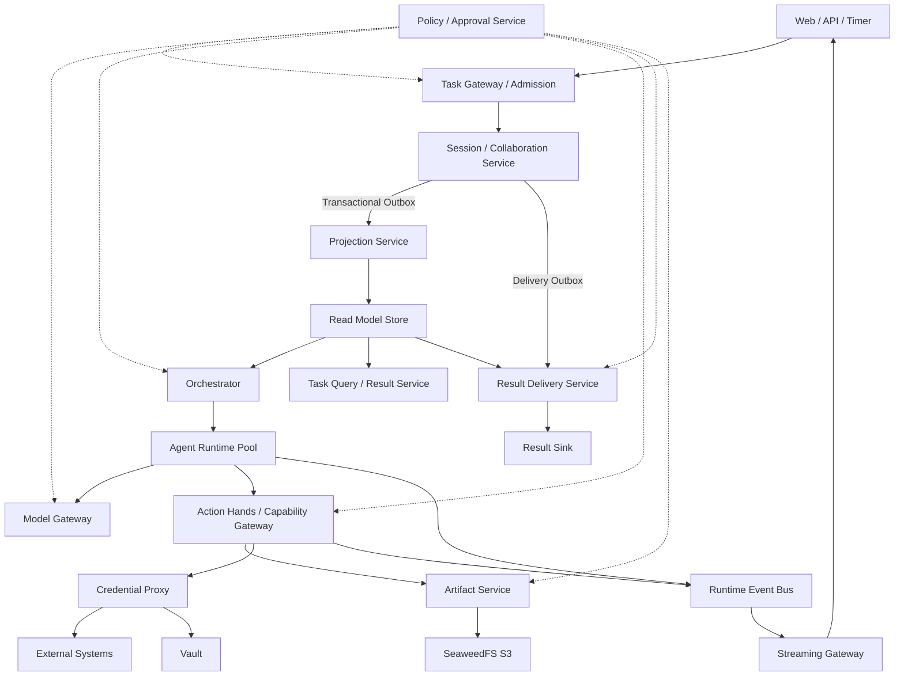

# Managed Agent 系统架构总览

本文档集以当前仓库实现、数据库迁移和生产装配为基线，将 Managed Agent 拆分为可核验的逻辑组件。
系统把长期任务视为由持久事实、派生视图、运行时控制、Agent Runtime、能力执行和交付平面共同组成的
分布式系统，而不是一个常驻 Agent 进程。文中的“当前实现”表示代码和迁移已经存在；“目标态”与
“待完善”不应被用作上线能力承诺。

## 阅读与维护规则

- 逻辑组件不等于进程：Query 与 Admission 同属 `task-api`；Coordinator、Worker、Reviewer 共用
  `agent-runtime`；Tool、Hands、MCP 与 Skill 控制面共用 `action-hands`。
- 事实以 `src/auraclaw/`、`migrations/`、`composition/builders/` 和生产配置的交集为准；测试只证明
  被覆盖的行为，不自动证明生产能力完整。
- 每份模块文档均给出实现归属、已实现基线、现有缺陷和待完善项。目标设计必须与当前实现分栏描述。
- 包与部署映射的维护入口是 [代码组织与部署映射](../code-organization.md)。

## 架构分层与实现映射

| 平面 | 逻辑组件 | 生产进程 | 主要代码与存储 |
|---|---|---|---|
| 接入与读取 | Admission、Command、Query、Transcript、Activity | `task-api` | `api/`、`gateways/task/`、`gateways/query/`、Projection 只读表 |
| 持久事实 | Session、Run、Collaboration、Canonical Outbox | `session` | `session/`、`domain/`、`session_core.*` |
| 派生状态 | Task/Collaboration/Approval Projection | `projection-worker` | `projection/`、`projection.*` |
| 调度控制 | Runnable、Lease、Assignment、Fencing | `orchestrator` | `control/`、`control.*` |
| 语义执行 | Coordinator/Worker/Reviewer、Model/Tool/Skill Loop | `agent-runtime` | `runtime/`；运行事件写 Kafka/Streaming Store |
| 推理 | Provider 调用、流式响应、预算、调用生命周期 | `model-gateway` | `model_gateway/`、`infrastructure/model/`、`model_gateway.*` |
| 能力与行动 | Tool、Resource、Prompt、MCP、Skill、Invocation | `action-hands` | `action/`、`infrastructure/connectors/`、`hands.*` |
| 安全信任域 | Policy/Approval、Credential/Vault | `policy`、`credential-proxy` | `policy/`、`credential_proxy/`、`policy.*`、`credential.*` |
| 内容存储 | Artifact 元数据与对象生命周期 | `artifact-service` | `artifact/`、`infrastructure/artifacts/`、`artifact.*`、S3 |
| 实时与交付 | SSE Replay、Delivery Job/Sink | `streaming-gateway`、`delivery-worker` | `gateways/streaming/`、`delivery/`、`streaming.*`、`delivery.*` |
| 横切治理 | Contracts、Identity、Observability、Admin Ops | 多进程 | `contracts/`、`internal/`、`observability/`、`composition/` |

## 总体原则

- Session Canonical Event Log 是任务事实源。
- Read Model Store 是可重建的查询副本，不是事实源。
- Control State Store 保存租约、心跳和调度队列等短期运行状态。
- Coordinator 决定任务如何拆分；Orchestrator 只负责运行实例调度。
- Runtime Event Bus 保存短期实时事件，不能替代 Session Event Log。
- Streaming Gateway 只推送通知，不接收改变任务状态的命令。
- Result Delivery 必须由持久 Outbox 事件触发，不能依赖短期实时流。
- Agent 可以使用外部能力，但不能读取真实凭证。

## 核心链路



## 文档索引

### 接入与交付

- [[01 Task Gateway Admission]]
- [[05 Task Query Result Service]]
- [[07 Streaming Gateway Service]]
- [[08 Result Delivery Service]]
- [[21 External Integration Contracts]]
- [[26 对话执行轨迹]]

### 持久事实与派生状态

- [[02 Session Collaboration Service]]
- [[03 Projection Service]]
- [[04 Read Model Store]]
- [[06 Runtime Event Bus]]
- [[17 Artifact Store]]

### 控制平面与 Agent Runtime

- [[09 Orchestrator]]
- [[10 Control State Store]]
- [[11 Agent Runtime Pool]]
- [[12 Coordinator Agent Runtime]]
- [[13 Worker Reviewer Runtime]]
- [[14 Model Gateway Inference Service]]

### 能力与行动

- [[15 Tool Gateway Dispatcher]]
- [[16 Hands Service]]
- [[23 MCP Runtime 能力平面]]
- [[25 Skill 生命周期与发布控制平面]]
- [[24 Model Skill 转换服务]]

### 安全与治理

- [[18 Policy Approval Service]]
- [[19 Credential Proxy Vault]]
- [[20 Observability Audit]]

### 公共契约

- [[22 Shared Event and State Contracts]]

## 事实与状态归属

| 数据 | 唯一写入方 | 存储位置 | 是否可重建 |
|---|---|---|---|
| 用户命令、模型完成输出、工具结果、审批结果、任务生命周期 | Session / Collaboration Service | Canonical Event Log | 否，事实源 |
| Control、Collaboration、Result、Approval 视图 | Projection Service | Read Model Store | 是 |
| 租约、心跳、Assignment、Runnable Queue | Orchestrator | Control State Store | 部分可恢复，短期状态 |
| Tool Invocation、Attempt、副作用状态 | Action Hands | Hands Invocation Store | 否，副作用证据 |
| Policy 版本、Decision Evidence、Approval Control State | Policy / Approval Service | Policy Store；重要审批事实回写 Session | 决策可重算，证据不可丢 |
| Token Delta、实时进度、Typing、短期状态 | Runtime producers | Runtime Event Bus | 不保证长期存在 |
| Artifact Metadata、ACL、Version、Lineage、Scan State | Artifact Service | PostgreSQL + SeaweedFS S3 Object | 元数据不可由对象反推完整重建 |
| Secret、OAuth Token、外部系统凭证 | Credential Proxy / Vault | Vault / KMS | 不进入 Session、Runtime 和 Sandbox |

## 部署边界

MVP 合并进程仍作为显式 development profile 保留。生产拓扑固定为 12 个独立入口，允许使用同一
monorepo 和应用镜像，但必须使用不同 service identity、配置、数据库角色、健康检查和扩缩容策略：

```text
1. task-api              Admission / Command / Query / Ops
2. session               Canonical Session / Collaboration 唯一事实写入口
3. projection-worker     Session Outbox/Event Feed -> Read Model / Runnable Outbox
4. orchestrator          Runnable / Lease / Assignment / Provision / Reconcile
5. agent-runtime         Coordinator / Worker / Reviewer Runtime Pool
6. model-gateway         Provider Secret / Model Call / Quota / Usage
7. action-hands          Hands Gateway + Connector 路由 + Invocation Store
8. policy                Policy / Approval / Budget / Data Egress
9. credential-proxy      Vault/KMS Proxy / Sign / Refresh / Credential Audit
10. artifact-service     Artifact Metadata/ACL/Version -> SeaweedFS S3
11. streaming-gateway    Runtime Event -> Replay/Router -> SSE
12. delivery-worker      Delivery Outbox -> Job/Attempt -> Sink
```

生产实现使用 `compose.prod.yml`：12 个入口沿用同一不可变镜像，但分别声明副本、资源、
service identity、数据库角色、健康检查和最小 Secret 文件挂载。Compose 集群只公开统一 ingress；
普通 Compose 的零停机升级由两套 project 蓝绿切流完成。

生产边界遵守以下规则：

- Session Event Log 只有 `session` 的数据库角色可写；其他服务通过版本化 Session Internal API 追加。
- Projection、Control、Hands Invocation、Policy、Credential Audit、Artifact Metadata、Delivery 各有唯一写入者。
- Task Query 由 `task-api` 使用 `task_query_ro` 只读 Projection；Orchestrator 只消费 Runnable Outbox/Feed。
- Runtime 到 Hands 使用协议无关内部 HTTP/JSON；MCP 与 Java API 只作为 Hands 下游 Connector。
- Runtime 只连接内部 Hands Gateway；外部数据、工具和技能经受管 Catalog、Policy、
  Credential Proxy 与 Artifact 边界接入，不能由 Runtime 直连第三方 MCP Server。
- Artifact Service 使用 PostgreSQL 保存业务元数据、SeaweedFS S3 保存对象；生产不依赖本地共享目录。
- Policy 对高风险、凭证和外发动作 fail closed；Credential Proxy 不提供返回明文 Secret 的接口。
- 所有内部写调用携带 tenant、command/operation id、expected version、actor、correlation 和 causation；
  Runtime/Hands 还携带可验证 Lease Assertion 与 Fencing Token。

详细决策、迁移顺序与回滚边界见
[ADR-001：生产服务部署边界与通信契约](../decisions/ADR-001-production-service-boundaries.md)。任何拆分都不得引入
跨组件数据库表直写、跨边界事务或共享超级用户凭证。

## 架构完成标准

- 任一 Brain、Hands 或 Orchestrator 实例死亡后，任务能够从 Session 恢复。
- 相同幂等键不会创建多个 Root Session 或重复外部副作用。
- Child Session 的依赖、所有权和结果可追踪。
- Projection 可以从 Canonical Event Log 全量重建。
- 网页断线不会取消任务，重连可以恢复可见事件。
- Result Delivery 重启后不会丢失完成通知。
- 审批与具体 action digest 绑定，不能跨动作复用。
- Sandbox 和 Agent Runtime 无法读取真实凭证。

## 当前系统级缺陷与演进重点

1. **目标态与实现成熟度不均衡。** Canonical Event、Projection、Control、MCP/Skill 和可靠性账本已经
   有较完整持久实现；多 Provider 路由、真正的隔离 Sandbox、通用 Timer、更多 Delivery Sink 和搜索型
   Read Model 仍不完整。
2. **控制面集中于 Action Hands。** MCP 注册、能力目录、Skill 发布与运行时调用共享同一部署单元，隔离
   主要依赖端口、数据库所有权和 workload identity；规模扩大后需要评估独立控制面进程。
3. **跨组件唤醒仍带轮询兜底。** Worker Wake 已降低空转，但 Projection、Orchestrator、Delivery、Skill
   对账仍需要周期扫描恢复漏通知，尚未形成统一的持久调度/通知机制。
4. **运维与 SLO 仍偏内建。** 已有 trace、metric、audit、alert 表和查询接口，但外部采集、告警路由、
   仪表盘、容量基线与演练证据不属于当前闭环。
5. **生产能力声明需要环境验证。** Compose、角色、Secret 文件、Kafka、PostgreSQL/Kingbase、S3/Vault
   适配均已存在；跨 AZ、灾备、备份恢复、滚动升级和真实第三方故障场景仍需独立验收。
