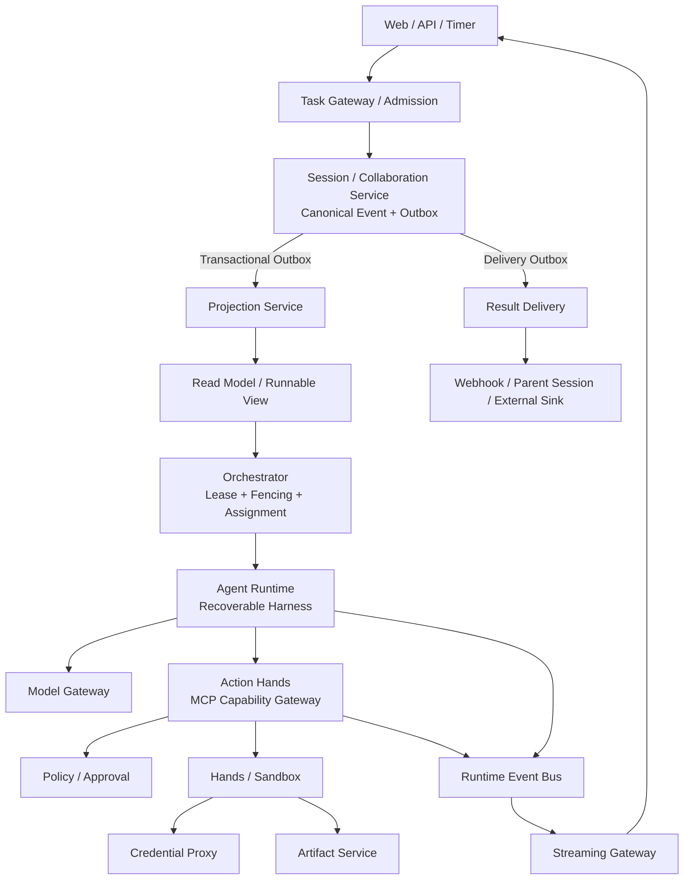
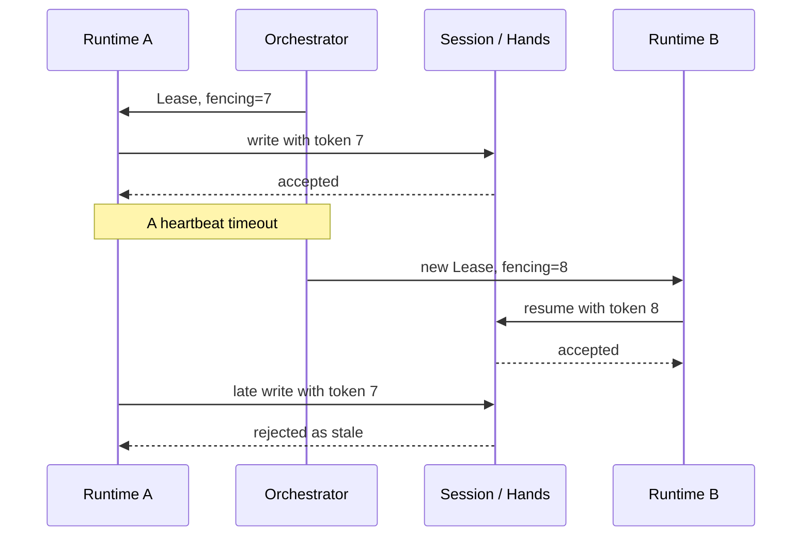
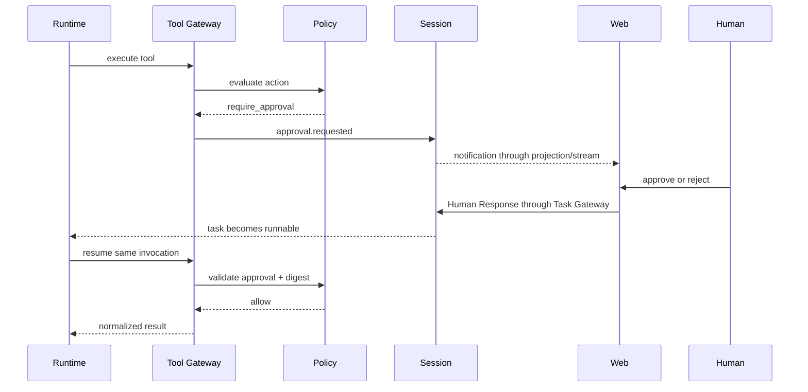
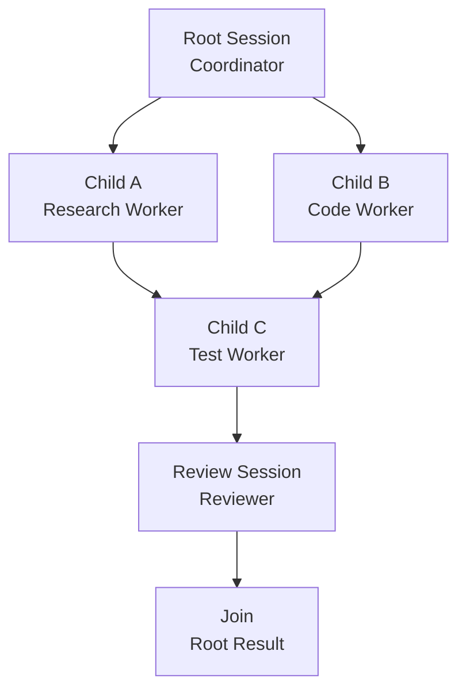
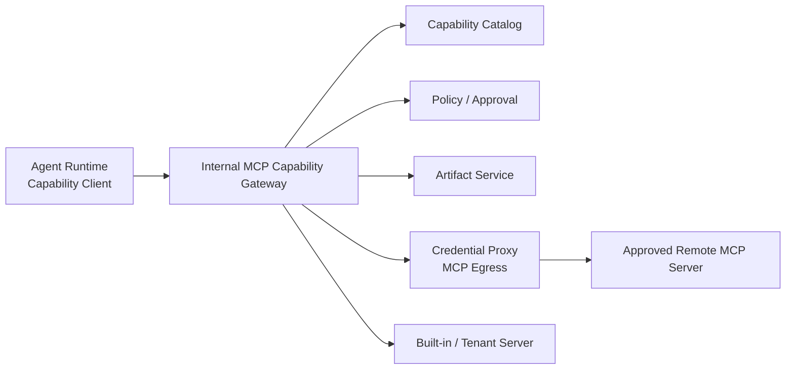

# AuraClaw：把 Agent 从“进程”变成“受管计算资源”

> 技术团队分享材料  
> 建议时长：50 分钟（40 分钟分享 + 10 分钟讨论）  
> 适合对象：后端、架构、AI 应用、平台工程、测试与运维团队

---

## 0. 分享目标

这次分享不重点讨论 Prompt 怎么写，也不比较某个模型的效果，而是回答一个更基础的问题：

> 当 Agent 开始执行分钟级、小时级甚至跨人工审批的长期任务时，我们应该如何把它建设成一个可恢复、可治理、可审计、可交付的工程系统？

分享结束后，希望大家能够理解：

1. AuraClaw 为什么不是一个“Agent Loop + HTTP API”的简单封装。
2. Canonical Event、Projection、Control State 和 Runtime Event 为什么必须分开。
3. Coordinator、Orchestrator、Agent Runtime 和 Tool Gateway 各自负责什么。
4. 系统如何处理进程死亡、重复执行、人工审批、凭证隔离和可靠交付。
5. 多 Agent、MCP、Resource、Tool 和 Skill 如何进入同一个受管能力平面。
6. 当前项目已经走到哪里，还存在哪些工程代价和后续工作。

### 时间安排

| 环节 | 建议时间 |
|---|---:|
| 背景与问题 | 5 分钟 |
| 核心设计与总体架构 | 10 分钟 |
| 恢复、安全与多 Agent | 15 分钟 |
| MCP、Skill 与生产落地 | 10 分钟 |
| Demo | 5～8 分钟 |
| 讨论 | 10 分钟 |

---

## 1. 开场：我们真正要管理的是什么

### 建议开场

大家晚上好，今天想分享的不是一个新的聊天机器人，也不是一个把大模型接上几个工具的 Demo，而是 AuraClaw 对“长期运行 Agent 系统”这个问题的一次工程化回答。

很多 Agent 项目的第一版都很相似：

```text
用户输入
  -> 拼 Prompt
  -> 调模型
  -> 模型决定是否调用工具
  -> 把结果放回上下文
  -> 继续循环
```

这个结构适合原型验证，但当任务需要持续运行、跨进程恢复、调用外部系统、等待人工审批、并行拆分或可靠通知时，真正困难的部分已经不再是模型调用，而是模型之外的系统能力。

传统实现往往把常驻 Agent 进程同时当成：

- 任务本身；
- 会话状态持有者；
- 调度器；
- 工具执行器；
- 凭证持有者；
- 实时流生产者；
- 最终结果交付者。

只要这个进程退出，上述职责就会一起失去可靠边界。

AuraClaw 的核心判断是：

> Agent 是可替换的计算单元；任务是不可丢失的业务实体。

“Managed Agent”中的 Managed，不是管理 Prompt，而是由系统基础设施管理任务生命周期、状态、协作、安全、资源调度、失败恢复和结果交付。

### 这一页要让听众记住

- 模型负责推理，不应该承担系统可靠性。
- Runtime 可以被替换，任务不能跟着 Runtime 一起消失。
- 长期任务首先是一个分布式系统问题，其次才是一个 Agent Loop 问题。

---

## 2. 从典型痛点反推架构

### 2.1 进程内状态无法支撑长期任务

如果对话、工具结果、当前步骤和最终状态只存在于 Agent 内存中，那么：

- 进程崩溃后无法判断任务做到哪一步；
- 重新启动可能重复调用模型或工具；
- 扩容后不同实例看到的状态不一致；
- 无法区分“系统失败”“模型失败”和“外部副作用状态未知”。

### 2.2 实时输出不是可靠交付

Token Delta、Typing 和进度消息适合改善交互体验，但它们天然允许短期丢失。把 SSE 或消息总线当成最终结果交付机制，会出现：

- 浏览器断线后丢失结果；
- Gateway 重启后无法恢复；
- 消费者重平衡时游标不连续；
- 用户看到“流结束了”，但系统没有持久的完成事实。

因此：

> Streaming 解决“现在看到了什么”，Delivery 解决“结果最终有没有送达”。

### 2.3 工具调用不是普通函数调用

一个写数据库、发邮件、创建工单或删除资源的工具调用，至少涉及：

- 输入 Schema；
- 权限和风险等级；
- 是否需要审批；
- 调用幂等；
- 超时与取消；
- 凭证使用；
- 副作用是否已经发生；
- 结果脱敏；
- Artifact 保存；
- 审计证据。

这些能力不能只靠 Prompt 中一句“执行前请确认”保证。

### 2.4 多 Agent 不只是并发调用多个模型

真正的多 Agent 协作还需要回答：

- 谁负责语义拆分？
- 谁决定子任务何时可运行？
- 子任务结果满足什么合同？
- Worker 能否写 Root Result？
- Reviewer 是否使用独立上下文？
- Coordinator 崩溃后是否重复创建 Child？
- 最终结果如何追溯到所有子结果和证据？

这些问题共同决定了 AuraClaw 的架构边界。

---

## 3. 核心设计哲学：三重外化

AuraClaw 把原本散落在 Agent 进程里的能力分成三类外化。

| 外化维度 | 外化对象 | 工程映射 |
|---|---|---|
| 状态外化 → 记忆 | 跨越时间的执行状态 | Canonical Session Event Log + Projection |
| 交互外化 → 协议 | 跨边界调用、权限和生命周期 | Command/Event Contract + Gateway |
| 经验外化 → 技能 | 流程、选择依据与约束 | Role Contract + Tool/MCP + Skill Package |

### 3.1 状态外化：上下文不是记忆

可以用一个类比解释：

> 上下文是模型的内存，Canonical Session Event Log 是系统的硬盘。

模型上下文应该只包含完成当前推理所需的历史切片，而不应该承担完整业务记录。优质的记忆系统不是把所有历史重新塞给模型，而是在正确的时间提供正确的历史。

### 3.2 交互外化：跨边界就必须有协议

当任务写入、模型调用、工具执行和审批跨越不同组件时，每一次写操作都需要显式上下文：

```text
tenant
command_id / operation_id
expected_version
actor
correlation
causation
lease assertion
fencing token
```

这使系统能够回答：

- 谁发起了这次操作？
- 它属于哪个租户和任务？
- 是否重复提交？
- 基于哪个状态版本执行？
- 是否来自已经失效的 Runtime？
- 这次操作由哪个上游事实导致？

### 3.3 经验外化：Skill 不等于 Prompt

Prompt 通常描述“这次怎么回答”，Skill 描述的是一个可复用、可版本化、可验证的过程资产：

- 什么时候适用；
- 什么时候不适用；
- 需要哪些 Tool 和 Resource；
- 有哪些步骤、约束和停止条件；
- 输入输出合同是什么；
- 使用哪个版本和内容摘要。

因此，Skill 不是一个更长的 Prompt，也不是单个 Tool 的别名。

---

## 4. 四类状态：整个架构最重要的区分

| 数据类型 | 作用 | 是否可重建 | 典型内容 |
|---|---|---:|---|
| Canonical Session Event Log | 唯一业务事实源 | 否 | 用户命令、模型终态、工具结果、审批、任务生命周期 |
| Read Model / Projection | 查询和调度所需的派生视图 | 是 | Task、Result、Collaboration、Approval、Runnable |
| Control State Store | 短期运行控制 | 部分可恢复 | Lease、Heartbeat、Assignment、Queue、Checkpoint |
| Runtime Event Bus | 实时体验与观测 | 不保证 | Token Delta、Typing、短期进度 |

### 4.1 Canonical Event 是事实

系统不直接保存一个可以被任意覆盖的“当前任务对象”，而是追加发生过的事实。例如：

```text
task.created
run.requested
run.scheduled
model.completed
tool.call.requested
approval.requested
human.response
tool.call.completed
run.completed
```

当前状态由这些事实演算得到。这样可以：

- 解释任务为什么处于当前状态；
- 做并发版本检查；
- 重建查询视图；
- 审计审批与副作用；
- 在 Runtime 故障后恢复。

### 4.2 Projection 是一次性视图

Projection 面向读取优化，可以按任务、租户或结果组织数据。它允许删除并从 Canonical Event 全量重建。

因此，Projection 落后不等于事实丢失。调度器需要等待目标 `min_version`，而不是扫描 Event Log 或基于旧视图贸然调度。

### 4.3 Control State 不是业务事实

心跳、CPU、内存、队列 claim 和 Lease 续期变化频繁，没有必要全部进入业务 Event Log。

但重要的生命周期变化，例如 `run.started`、`runtime.failed` 和 `run.terminated`，仍然要通过 Session Service 写回 Canonical Event。

### 4.4 Runtime Event 可以丢，最终结果不能丢

Token Delta 丢失会影响体验，但不应该影响任务正确性。完整模型输出和最终结果必须进入 Canonical Event；完成通知必须由持久 Outbox 驱动。

### 这一节的关键句

> 不要问“这个状态存在哪里”，先问“它是事实、视图、控制状态，还是实时信号”。

---

## 5. 总体架构：一次任务的完整旅程



### 5.1 写入和查询链路

```text
POST Task
  -> Task Gateway 做租户、幂等和命令校验
  -> Session Aggregate 校验状态转换与 expected_version
  -> Event + Command Result + Outbox 同事务提交
  -> Projection Worker 消费 Outbox
  -> 更新 Task/Result/Runnable Projection
  -> GET Task 从 Read Model 查询
```

如果客户端提交超时，使用相同幂等键重试，应该得到同一个 Session，而不是创建第二个任务。

### 5.2 调度和执行链路

```text
Runnable Projection
  -> Orchestrator 原子 Claim
  -> 获取 Lease 和递增 Fencing Token
  -> 创建 Assignment
  -> Runtime 读取任务与 Checkpoint
  -> 调用 Model / Capability
  -> 关键结果写回 Session
  -> 完成或等待下一轮
```

### 5.3 实时和交付链路

```text
Token / Progress
  -> Runtime Event Bus
  -> Streaming Gateway
  -> SSE Client

Terminal Canonical Event
  -> Delivery Outbox
  -> Delivery Job / Attempt
  -> Retry / Circuit Breaker / DLQ
  -> Webhook / Parent Session / External Sink
```

这两条链路互不替代。浏览器断线不会取消任务，Runtime Event Bus 故障也不会丢失最终结果。

---

## 6. 四个核心角色的职责边界

| 组件 | 回答的问题 | 明确不做 |
|---|---|---|
| Coordinator | 任务如何拆分，依赖如何组织，结果如何汇总？ | 不管理 Lease，不调度基础设施 |
| Orchestrator | 哪个 Session 由哪个 Runtime 在什么资源上运行？ | 不读取自然语言后自行拆任务 |
| Agent Runtime | 在给定 Role、预算和能力下如何完成本轮推理？ | 不直接写数据库，不读取 Secret |
| Tool/MCP Gateway | 能力能否发现、加载和调用，调用如何治理？ | 不拥有业务 Session 状态 |

### 6.1 Coordinator 与 Orchestrator 为什么必须分开

Coordinator 是语义角色：

- 判断任务是否值得拆分；
- 创建 Child Goal 和 Output Contract；
- 设置依赖；
- 选择 Worker/Reviewer Role；
- 等待、修复、重新规划和汇总。

Orchestrator 是控制平面：

- 观察 runnable；
- 处理优先级、容量和租户公平；
- 获取 Lease；
- 分配 Runtime；
- 监测心跳；
- 回收、恢复和重新调度。

如果把两者合并，Prompt 策略会和基础设施调度强耦合。拆开以后，任务分解策略和资源调度机制可以独立演进。

### 6.2 Runtime 为什么不能直接写 Session 数据库

Runtime 是概率性计算资源。它可能被重复启动、被网络分区、持有旧 Lease，甚至产生格式错误的结果。

所有业务写入都必须经过 Session 的身份、版本、事件 allowlist 和 fencing 校验。即使 Runtime 认为自己仍然拥有任务，只要 Fencing Token 已经过期，Session 和 Hands 都必须拒绝它。

---

## 7. 可恢复执行：Runtime 可以死，任务不能丢

### 7.1 Lease 与 Fencing Token

Lease 表示 Runtime 在有限时间内拥有执行权，Fencing Token 是每次接管时单调递增的版本号。

假设：

1. Runtime A 获得 token 7；
2. A 因网络分区停止心跳；
3. Lease 过期，Runtime B 接管并获得 token 8；
4. A 恢复网络，尝试继续写入。

此时仅依靠“Lease 已过期”并不够，因为 A 可能不知道自己已经失效。Session 和 Hands 必须记住已接受的最高 token，并拒绝 token 7 的所有写入和外部副作用。



### 7.2 Checkpoint 保存什么

Checkpoint 保存恢复控制状态，而不是替代业务事实。Capability-Aware Loop 中包括：

```text
phase
turn
call index
accumulated steps / token / cost
loaded capability binding
active skill
pending invocation
side events waiting to append
resume cursor
artifact refs
```

重要的模型终态、Tool/Skill/Resource 采用和任务终态仍然进入 Canonical Event。

### 7.3 为什么在工具完成后还要 Checkpoint

最危险的故障窗口是：

```text
外部工具已经执行成功
  -> Runtime 在写回 Session 前死亡
```

如果新 Runtime 只看到 Session 中没有结果，直接重放工具，就可能产生重复副作用。

AuraClaw 使用稳定 `tool_invocation_id`、业务幂等键和 Hands Invocation Store 保存副作用状态。工具完成后，Checkpoint 还会保存待补写的 Canonical Side Events。新 Runtime 先补写事实，再继续下一轮，不重新执行调用。

### 7.4 副作用未知时不自动重放

网络超时不代表外部动作没有发生。统一 Tool Result 必须区分：

```text
success
error
denied
timeout
cancelled
unknown
```

当 `side_effect_status=unknown` 时，系统应查询、补偿或请求人工判断，而不是盲目重试。

---

## 8. 工具、安全与审批闭环

### 8.1 Tool Gateway 的职责

```text
Agent Runtime
  -> Registry / Capability Discovery
  -> Input Schema Validation
  -> Permission / Policy
  -> Approval Validation
  -> Invocation Correlation / Idempotency
  -> Hands / Credential Proxy
  -> Result Normalization / Redaction
  -> Inline Result or Artifact Ref
```

工具权限至少分为：

- `read-only`
- `suggest-only`
- `write-with-approval`
- `write-autonomous`
- `destructive/admin`

模型或远端 MCP Server 声明“这是只读工具”只能作为提示，权威风险等级由 AuraClaw Policy 决定。

### 8.2 审批为什么要绑定 Action Digest

审批对象不是一句模糊的“允许发送邮件”，而是一个不可变动作：

```text
approval_id
tenant_id
session_id / run_id
action_digest(tool + normalized arguments)
policy_version
expires_at
```

只要收件人、正文、目标资源、工具版本或权限发生变化，摘要就会变化，旧审批立即失效。

### 8.3 Human-in-the-Loop 主链路



注意：Streaming Gateway 只负责通知，不能接收审批结果。Human Response 必须经过 Task Gateway 的鉴权、幂等和版本检查，最终写入 Canonical Event。

### 8.4 Secret 为什么不能进入 Runtime

Agent Runtime 和 Sandbox 都不应该读取真实凭证：

- Runtime 只持有 `credential_ref`；
- Credential Proxy 负责 Vault/KMS resolve、OAuth refresh、目标 allowlist 和签名；
- Model Provider Secret 只存在于 Model Gateway 信任域；
- SeaweedFS 管理凭证只存在于 Artifact Service；
- 返回内容进入 Session 前统一脱敏。

概率性模型可以决定“想做什么”，但不能直接获得“用什么身份做”的秘密。

### 8.5 Artifact 边界

大型 Tool Result、文件、二进制资源和需要长期引用的内容进入 Artifact Store：

- PostgreSQL 保存 Metadata、ACL、Version、Lineage、Classification 和 Scan State；
- SeaweedFS S3 保存对象字节；
- ready 版本不可覆盖；
- Session 只保存 `artifact_ref`；
- 下载前再次进行 Policy/ACL 校验并签发短期 URL。

---

## 9. 多 Agent 协作：DAG、合同与独立评审

### 9.1 什么时候值得启用 Coordinator

并不是每个任务都需要多 Agent。只有出现以下情况时，拆分才可能带来收益：

- 子任务可以并行；
- 需要不同模型、工具、权限或 Sandbox；
- 需要隔离上下文和失败；
- 子任务有独立输出合同或 Artifact；
- 需要独立 Reviewer。

简单顺序任务继续使用单 Session，避免不必要的协调成本。

### 9.2 Root/Child DAG



DAG 由 Collaboration Service 校验：

- 同一 tenant 和 Root；
- 无环、自依赖和非法跨 Root 引用；
- 深度、宽度、Child 总数和预算受限；
- 只有依赖完成的 Child 才成为 runnable；
- 创建 Child 使用稳定 `task_key`，Coordinator 重启不会重复创建。

### 9.3 Worker 与 Reviewer 的隔离

Worker：

- 读取 Child Goal、Input Refs 和 Output Contract；
- 在最小上下文中执行；
- 只能写自己的 Child；
- 结果通过合同后才能进入 completed。

Reviewer：

- 使用独立 Session 和上下文；
- 收集测试、反例与政策证据；
- 输出 `accepted`、`changes_requested` 或 `rejected`；
- 不直接覆盖 Worker Artifact。

最终 Join 保存：

- Child Result；
- Review Evidence；
- Artifact Lineage；
- 限制和未解决问题。

因此，“多个 Agent 给出多个回答”并不是协作；有所有权、有依赖、有合同、有证据的结果合并才是协作。

---

## 10. MCP Capability Plane：统一数据、工具和技能入口

### 10.1 为什么不能让 Runtime 直接连接第三方 MCP

如果模型可以提交任意 Server URL、stdio command 或 Header，那么：

- Runtime 会接触第三方凭证；
- 无法统一做 tenant 和 Policy 控制；
- 存在 SSRF、DNS rebinding 和重定向风险；
- Server Schema 或描述可以污染模型上下文；
- 版本漂移后无法恢复历史行为；
- 每个 Runtime 都要维护连接、熔断和鉴权逻辑。

AuraClaw 的生产 Runtime 只连接内部 Action Hands MCP Capability Gateway。



### 10.2 MCP 原语与 AuraClaw 概念

| AuraClaw 概念 | MCP 表达 | 主要控制方 | 语义 |
|---|---|---|---|
| 数据 | Resource / Resource Template | Application / Runtime | 稳定上下文、文件、Schema 或快照 |
| 工具 | Tool | Model | 有明确输入输出和副作用的原子动作 |
| 提示模板 | Prompt | User / Host | 显式选择的交互模板 |
| 技能 | Resource + Skill Manifest | Runtime | 可版本化流程、约束和依赖绑定 |

MCP 没有原生 Skill 概念，因此 Skill 包由 AuraClaw 扩展治理。

### 10.3 Resource、只读 Tool 和 Skill 怎么选

| 场景 | 建议表达 |
|---|---|
| 稳定 URI 的文件、文档、Schema、记录或快照 | Resource |
| 用有限参数定位稳定对象 | Resource Template |
| 搜索、聚合、计算或动态查询 | read-only Tool |
| 写入、发送、删除或产生副作用 | Tool |
| 描述多步骤流程、决策与约束 | Skill |

### 10.4 外部内容一律按不可信数据处理

Resource 进入模型前需要经过：

```text
URI / tenant ACL
  -> Policy / Data Egress
  -> MIME 和大小限制
  -> Malware / DLP / Secret Scan
  -> Prompt Injection Finding
  -> 截断或 Artifact 化
  -> Context Policy 决定是否注入
```

如果检测到 Prompt Injection Finding，正文不会进入模型。Tool annotations、描述和 Schema 同样不能自动获得权威性。

### 10.5 Skill 的固定绑定

Skill Package 至少包括：

```text
skill package
├── manifest.json
├── SKILL.md
├── references/
├── scripts/*.workflow.json
├── assets/
└── tests/
```

Resolver 会固定：

- package digest；
- Tool schema digest；
- Resource revision/digest；
- Policy version 和 decision；
- publisher、name 和 version。

运行过程中 Catalog 即使出现新版本，已经激活的 Skill 也不会静默漂移。

---

## 11. Capability-Aware Agent Loop：渐进式披露

传统 Agent 往往在第一轮就把所有 Tool Schema 塞进模型上下文。能力数量增多后会带来：

- Token 消耗；
- 上下文噪声；
- 同名工具冲突；
- 模型误调用；
- 不必要的能力暴露。

AuraClaw 的普通任务循环采用渐进式披露：

```text
Model
  -> capabilities.search
  -> capabilities.load(capability_id)
  -> 权威 Tool Schema / Skill / Resource Binding
  -> Tool / Skill / Resource Call
  -> Result 回到 Transcript
  -> Next Turn
  -> Final Result
```

### 安全约束

- 初始只暴露固定 bootstrap tools；
- `load` 只能接受当前 Run 搜索结果中的 `capability_id`；
- 未加载 Tool 即使被模型伪造，也返回 `capability_not_loaded`；
- 模型不能提供 tenant、Role、Policy、Credential 或 Server URL；
- Resource 只能读取已加载 URI/template；
- Skill 激活只接受 `capability_id + inputs`，权威身份来自 Assignment 和 Catalog。

### 预算和无进展检测

整个 Run 统一累计：

- 模型轮次；
- capability calls；
- Token；
- Cost；
- 搜索、候选和加载数量。

相同名称和参数连续重复超过阈值会被视为无进展循环，而不是无限消耗预算。

### 恢复状态

```text
capability.model_pending
capability.model_completed
capability.call_completed
capability.approval_waiting
capability.completed
```

模型完成、Capability 完成和审批等待都有独立恢复点。

---

## 12. 生产服务边界与部署

开发环境可以使用 `auraclaw serve` 合并运行，但生产拓扑固定为 12 个入口：

| 服务 | 核心职责 |
|---|---|
| task-api | Admission、Command、Query、Ops |
| session | Canonical Session / Collaboration 唯一事实写入口 |
| projection-worker | Projection 与 Runnable Outbox |
| orchestrator | Queue、Lease、Assignment、Checkpoint、Reconcile |
| agent-runtime | Coordinator / Worker / Reviewer Harness |
| model-gateway | Provider Secret、模型调用、Quota、Usage |
| action-hands | MCP Gateway、Hands、Invocation Store |
| policy | Policy、Approval、Budget、Data Egress |
| credential-proxy | Vault/KMS、OAuth、签名和凭证审计 |
| artifact-service | Metadata、ACL、Version、Lineage 和 S3 对象访问 |
| streaming-gateway | Runtime Event Replay 与 SSE |
| delivery-worker | Delivery Job、Retry、Circuit 和 DLQ |

### 12.1 逻辑拆分不等于目录 1:1

项目使用同一 Python monorepo 和同一不可变镜像，不强制一个目录对应一个进程。生产通过不同 entrypoint、service identity、数据库角色、Secret 挂载和资源配置形成真实边界。

### 12.2 唯一写入者

每个数据域只有一个 owner：

| 数据域 | 唯一写入身份 |
|---|---|
| Session/Event/Snapshot/Outbox | session |
| Projection/Runnable Outbox | projection-worker |
| Control/Lease/Assignment/Checkpoint | orchestrator |
| Hands Invocation/Attempt | action-hands |
| Policy/Decision | policy |
| Credential Reference/Audit | credential-proxy |
| Artifact Metadata | artifact-service |
| Delivery Job/Attempt/DLQ | delivery-worker |

服务共享数据库集群不等于共享写权限，更不能使用跨域超级用户或跨边界事务。

### 12.3 发布策略

- 生产固定使用 Docker Compose；
- 数据库迁移采用 expand/migrate/contract；
- migration 使用 checksum ledger 和数据库锁；
- 应用使用不可变镜像；
- 普通 Compose 更新不视为零停机；
- 零停机通过 blue/green 两套 project 切流；
- 切流前必须验证真实 canary 的 Runnable、Model/MCP、Canonical Result、SSE 和 Delivery。

### 12.4 故障演练不是可选项

典型 kill test：

- 杀掉持有 Lease 的 Runtime，确认 TTL 后接管；
- 旧 Fencing Token 写入必须失败；
- 停止 Policy/Vault，写操作必须 fail closed；
- 暂停 Kafka，Canonical Result 仍然完成；
- 杀掉 Delivery claim owner，过期后重试且不重复副作用；
- 中断 Artifact multipart，恢复后 finalize/GC 可重入。

AuraClaw 的架构完成标准不是“正常路径跑通”，而是关键组件死亡后任务仍能恢复到可解释状态。

---

## 13. 当前实施进度

根据阶段清单，项目当前状态可以分为三层。

### 13.1 已完成的主体链路

- P0～M8：Python 后端重构、事实/查询闭环、Managed Runtime、工具审批、多 Agent、实时体验、可靠交付、观测、前端工作台和生产基础设施接入；
- S0～S5：生产边界 ADR、跨服务契约、12 入口、唯一写入者、横向扩展、Docker Compose 生产部署和故障演练；
- 主存储统一使用 PostgreSQL；生产可运行在 KingBase PostgreSQL 兼容模式。

### 13.2 已实现、处于审阅或收口阶段

- M9 MCP Runtime 能力平面：实现完成，仍需结合质量环境和堆叠 PR 状态收口；
- M11 Capability-Aware Agent Loop：实现和质量门禁完成，等待 Draft PR 审阅。

### 13.3 增量建设中的能力

M10 Model Skill 转换已经完成：

- 从 tenant-scoped PostgreSQL 读模型读取；
- 编译签名 Skill Package；
- 通过 `skill://` MCP Resource 暴露；
- Runtime Client 加载；
- 单进程周期全量对账和幂等发布。

后续仍需完成：

- 权威 Source Snapshot Schema；
- 持久 Publication/Sync State；
- 多副本租约和 Quarantine；
- 确定性公式执行 Tool；
- 受控 writeback；
- 完整生产恢复与安全门禁。

### 对进度的表达建议

分享时避免笼统说“所有能力已经生产完成”。更准确的表述是：

> 主体 Managed Agent 与生产服务边界已经形成；MCP 和 Capability Loop 已完成实现并在审阅收口；Model Skill 已跑通预览闭环，生产级持久化和确定性执行仍在建设。

---

## 14. Demo 脚本

建议优先演示“恢复 + 审批 + 可靠结果”，它比单纯展示模型回答更能体现项目差异。

### 14.1 Demo 前准备

- 启动开发或多服务环境；
- 准备一个会触发 Tool 的任务；
- Tool 使用稳定幂等键；
- 准备一个 `write-with-approval` 动作；
- 打开 Task Query、SSE、Timeline/Observability 页面；
- 准备 Runtime 容器或进程的 kill 命令；
- 预先验证所有外部依赖，避免把分享时间消耗在环境问题上。

### 14.2 演示步骤

#### 步骤一：创建任务

展示：

- `POST /v1/tasks` 返回 Session/Run；
- 重复提交相同幂等键返回同一个 Session；
- Canonical Event 中出现创建和运行请求；
- Projection 提供可查询状态。

讲解重点：

> API 返回 202 只表示任务已被可靠接纳，不表示任务已经完成。

#### 步骤二：观察调度

展示：

- Runnable Projection；
- Orchestrator claim；
- Lease、Fencing Token 和 Assignment；
- Runtime 开始执行。

讲解重点：

> Orchestrator 看的是结构化 runnable 状态，不扫描完整对话，也不理解自然语言。

#### 步骤三：杀掉 Runtime

在模型调用或 Tool 完成后的恢复点杀掉 Runtime。

展示：

- 心跳超时；
- Lease 过期；
- 新 Runtime 获取更高 Fencing Token；
- 从 Checkpoint 恢复；
- 已完成调用没有重复执行。

讲解重点：

> 我们不是保证进程不死，而是保证进程死亡后任务仍然可恢复、可解释。

#### 步骤四：触发审批

展示：

- Tool Gateway 返回 `approval_required`；
- Session 写入 `approval.requested`；
- 页面收到通知；
- 用户通过 Task Gateway 批准；
- Runtime 继续同一个 invocation 和 idempotency key。

讲解重点：

> 审批绑定动作摘要，修改参数后不能复用旧审批。

#### 步骤五：断开 SSE

关闭或断开页面连接，等待任务完成，再重新连接或直接查询结果。

展示：

- Token Delta 可能不完整；
- Task Query 可以读取完成状态；
- Delivery Job 仍然执行；
- Artifact 和结果 lineage 可查询。

讲解重点：

> 实时流是体验，Canonical Result 和 Delivery 才是可靠交付。

### 14.3 Demo 失败时的降级方案

提前准备以下截图或日志片段：

- Event Timeline；
- Lease 接管前后 token；
- Checkpoint phase；
- Approval Request 与 Human Response；
- Hands Invocation 幂等记录；
- Delivery Attempt；
- Artifact lineage。

即使现场环境异常，也可以按照事实链路完成讲解。

---

## 15. 工程取舍与代价

AuraClaw 并不是所有 Agent 项目的默认答案。

### 15.1 这套架构适合什么场景

- 任务运行时间长；
- 外部动作有真实副作用；
- 需要人工审批；
- 需要多租户和权限隔离；
- 任务失败后必须恢复；
- 结果需要可靠送达；
- 需要审计、合规或结果 lineage；
- Agent、模型、工具和运行资源需要独立演进。

### 15.2 什么场景不值得使用

- 一次性、低风险、秒级请求；
- 不调用外部写工具；
- 失败后可以让用户直接重试；
- 没有长期状态和审计要求；
- 团队还没有运维消息系统、数据库迁移和多服务的能力。

此时，一个结构清晰的单进程 Agent 应用可能更经济。

### 15.3 AuraClaw 付出的代价

- Event Schema 和兼容性治理更复杂；
- 最终一致性需要处理 Projection Lag；
- 每个同步边界都需要超时、重试和熔断；
- 多服务增加本地开发和部署成本；
- Canonical、Checkpoint、Invocation、Artifact 和 Delivery 之间需要明确证据关联；
- 故障注入和恢复测试比普通 API 测试更重；
- 团队必须严格遵守唯一写入者和依赖方向。

### 15.4 为什么仍然值得

如果业务要求任务不可丢、动作不可重复、凭证不可泄露、审批不可绕过、结果必须送达，那么这些复杂度客观存在。区别只在于：

- 把它们显式建模、测试和运维；
- 或者让它们隐含在 Agent Loop 和事故处理中。

---

## 16. 总结

AuraClaw 的核心不是“更多 Agent”，而是让 Agent 具备成为生产系统计算资源所需的边界。

可以用六句话收尾：

1. Agent 是可替换的计算单元，任务是不可丢失的业务实体。
2. Canonical Event 是事实，Projection 是可重建视图。
3. Coordinator 负责语义拆分，Orchestrator 负责资源调度。
4. Runtime Event 提供体验，持久 Outbox 和 Delivery 保证交付。
5. 概率性推理可以决定意图，但外部副作用必须由确定性机制治理。
6. MCP 统一能力入口，但不能替代 Session、Lease、Invocation、Artifact 和 Delivery。

### 最后一页

> Managed Agent 的本质，不是让模型管理更多东西，而是让系统能够管理模型的不确定性。

---

## 17. 讨论题

1. Event Sourcing 带来的复杂度，在哪些业务场景下才值得？
2. 哪些 Agent 状态应该成为 Canonical Fact，哪些只应该是 Checkpoint 或 Projection？
3. Tool 的自主执行边界应该由风险等级、租户策略还是用户偏好决定？
4. Coordinator 的动态重规划如何避免 DAG 无限增长？
5. Reviewer 使用另一个概率性模型时，证据可信度如何度量？
6. MCP 应该只作为互操作协议，还是可以承担内部统一能力平面？
7. Skill 的版本固定和快速修复之间如何平衡？
8. 12 个逻辑服务是否都需要物理拆分？哪些可以在早期合并部署？
9. 下一阶段应优先建设 Skill 生态、评测体系、调度策略，还是运维自动化？

---

## 18. 常见问题与参考回答

### Q1：为什么不用一张 Session 表保存当前状态？

当前状态可以查询，但无法完整解释它是如何产生的。长期任务涉及并发写入、恢复、审批和副作用，Canonical Event 能保留因果链，并允许 Projection 重建。对于简单任务，一张状态表更便宜；AuraClaw 解决的是高可靠长期任务。

### Q2：Kafka 能不能直接作为任务事实源？

AuraClaw 中 Kafka Runtime Event 主要承载实时事件，不承担业务最终事实。Canonical Event 与 Transactional Outbox 由 Session Store 保证原子写入，避免业务提交成功但消息丢失，或者消息发布成功但业务没有提交。

### Q3：有幂等键为什么还需要 Fencing Token？

幂等键解决同一个动作重复提交，Fencing Token 解决旧执行者在所有权转移后继续写入。两者防止的是不同问题。

### Q4：为什么 Reviewer 不直接修改 Worker 的结果？

覆盖会破坏原始产物与评审证据之间的可追溯关系。Reviewer 应发布 Finding、Decision、Patch 或 Repair Request，由新的事实描述修复过程。

### Q5：为什么 MCP Task 不能直接当 AuraClaw Task？

MCP Task 是远端协议调用的可选句柄，不包含 AuraClaw 的 Session 事实、Lease、审批、协作、交付和多租户语义。两者生命周期和可靠性边界不同。

### Q6：为什么所有 Tool Schema 不一次性给模型？

能力数量增大后会消耗 Token、增加噪声和误调用风险。渐进式披露让模型先搜索，再加载少量权威 Schema，同时形成可审计的 capability binding。

### Q7：Runtime 崩溃后会不会重复调用模型？

取决于崩溃点。模型调用前、完成后和 Capability 完成后都有 Checkpoint。已经持久化完成状态的调用不会重复；没有明确完成证据的调用会依据具体端口的幂等与恢复语义处理。

### Q8：为什么开发环境还保留合并进程？

逻辑边界和物理部署不需要同步增加复杂度。开发合并进程便于调试和快速启动，但使用与生产一致的端口和契约；生产再通过不同入口、身份、数据库角色和 Secret 形成真实隔离。

---

## 19. 参考资料

- [AuraClaw README](../../README.md)
- [Managed Agent 系统架构总览](../architecture/system/00%20Managed%20Agent%20系统架构总览.md)
- [开发方案与实施计划](../architecture/system/00%20Managed%20Agent%20系统架构总览.md)
- [开发阶段校验清单](../development/stage-gates.md)
- [生产服务部署边界与通信契约](../architecture/decisions/ADR-001-production-service-boundaries.md)
- [MCP Runtime 能力平面](../architecture/system/23%20MCP%20Runtime%20能力平面.md)
- [M9 MCP Runtime 实施与运维](../development/implementation/mcp-runtime.md)
- [M11 Capability-Aware Agent Loop 实施与运维](../development/implementation/capability-aware-agent-loop.md)
- [Docker Compose 生产部署与故障演练 Runbook](../operations/production-deployment.md)
