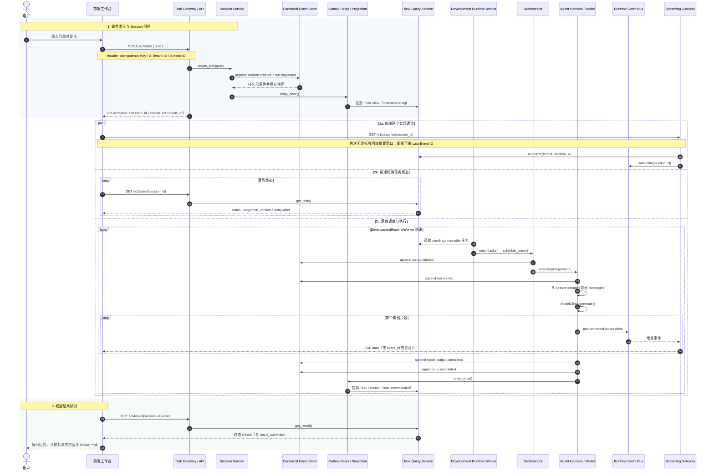
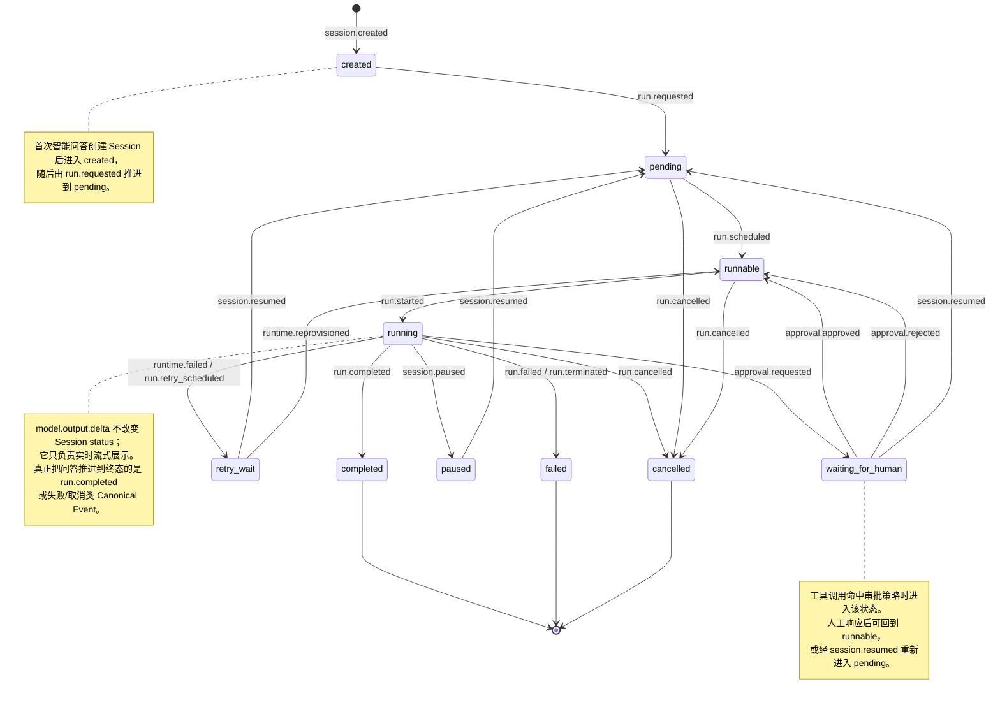

*协议不是外围 plumbing，是让外化记忆、外化技能真正进入现实系统并被治理的表征基础设施。*
**问题**：智能体在跨系统边界执行动作时，需要临时处理格式、状态、权限、发现等交互复杂性，仅依赖大模型的推理处理这些交互会导致外部行动脆弱且不可治理。
**解法**：通过在运行时引入协议层，将交互所需的契约显式化、类型化和可执行化，把原本依赖模型即兴推理的交互负担外部化为可治理的系统机制。

# 为什么需要协议（交互外化）？
*协议的价值，是把智能体系统从临时拼接提升为可互操作、可治理、可严谨的基础设施，将不适合由模型稳定承担的交互负担外部化。*
## 1. 标准化 → 提升互操作性
**标准化的对象**
- 能力发现
- 调用
- 委派/交接
- 状态交换
**标准化的作用**
- 减少各系统之间`prompt + parser`式的临时拼接
- 提升不同工具、智能体、前端和运行时之间的互操作性
- 为稳定的多智能体协作提供共同表示基础
- 使委派与上下文传递能够被自动化
**标准化的内涵**
提升**兼容性**、**可组合性**、**跨系统协作能力**。
## 2. 显式约束 → 提升安全、治理与可审计
**显式约束的对象**
- 权限
- 身份
- 执行轨迹
- 失败状态
- 责任边界
**显式约束的作用**
- 行为边界更清晰
- 运行时可以进行校验、约束与执行
- 系统行为可以被审计、追责和恢复
- 将原本隐含的胶水逻辑转化为可验证的治理机制
**显式约束的内涵**
提升**可控性**、**可治理性**、**可审计性**、**可追踪性**和**系统安全性**。
## 3. 开放契约 → 提升可移植性并降低厂商绑定
**开放契约的作用**
- 将交互契约从模型供应商特定接口中抽离，降低对特定模型供应商和运行时实现的依赖
- 提高系统可移植性与长期演进能力
**开放契约内涵**
提升**架构灵活性**、**可移植性**和**长期可演化性**。
# 协议如何分类

| 主要交互边界 | 核心外部化负担 | 核心收益 | 代表协议 |
|---|---|---|---|
| 智能体 ↔ 工具/服务 | 调用语法、能力发现 | 互操作性、可扩展性 | MCP |
| 智能体 ↔ 智能体 | 委派、状态交换、交接协调 | 多智能体协作、协调可扩展性 | A2A、ACP、ANP |
| 智能体 ↔ 用户/前端 | 界面表示、执行状态流 | 可观察性、可移植展示 | A2UI、AG-UI |
| 智能体 ↔ 垂直业务系统 | 领域治理、授权审计、责任追踪 | 高风险流程治理、合规性 | UCP、AP2 |

# 如何实现协议（交互外化）？
*协议在 Harness 中不是静态文档，而是运行时的控制面，它参与执行控制、权限校验、状态推进、持久化衔接和恢复协调。*
## 1. 意图捕获与规范化
**形式**  
将模型生成的自然语言输出转化为**显式指令、事件或协议对象**，并在执行前完成校验。
**作用**
- 提升执行可靠性
- 降低歧义
- 增强治理能力
**外部化的负担**
- 执行语义解释
- 动作格式推断
**关键原则**
- 先规范化，后执行
- 先校验契约，再触发动作
## 2. 能力发现与工具描述
**形式**  
通过结构化元数据暴露当前可用工具、schema 与输入输出结构。
**作用**
- 降低提示词膨胀
- 增强可治理性
- 支持动态能力发现
**外部化的负担**
- 工具可用性判断
- 调用契约记忆
- 能力边界推断
**关键原则**
- 模型不再猜测可用能力，而是读取已声明的能力面
## 3. 会话与生命周期管理
**形式**  
将长程执行建模为具有状态、阶段和迁移规则的生命周期对象，并协调 checkpoint 与 recovery。
**作用**
- 支持长程任务执行
- 支持故障恢复
- 维持状态连续性
**外部化的负担**
- 多轮状态维持
- 阶段流转
- 恢复逻辑协调
**关键原则**
- 协议维护交互连续性
- 记忆维护跨时间连续性
- 协议状态不等于记忆，协议负责维持交互连续性；当状态或结果被写入持久化存储后，才转化为记忆
### AuraClaw：智能问答时序
智能问答是前端工作台通过公开 HTTP/SSE API 完成的一次完整问答闭环：用户提问 → 创建 Session → 实时流式展示 → 以 Task / Result API 核对终态答案。下文以当前开发环境联调路径为准（`DevelopmentRuntimeWorker` + 确定性 Model Client）。

#### 时序要点
- **命令与查询分离**：写侧经 Task Gateway 进入 Canonical Event Log；读侧只走 Projection（Task Query），前端不直接读 Event Store。
- **事实与流分离**：`session.created`、`run.requested`、`run.completed` 等 Canonical Event 是任务事实源；`model.output.delta` 只经 Runtime Event Bus / SSE 推送，丢失不意味着结果未生成。
- **流式是体验层，Result 是权威层**：SSE 负责增量展示与断线续传；任务是否完成、最终答案以 `GET /v1/tasks/{session_id}/result` 为准。
- **执行由 Runtime 异步推进**：API 返回 `202 Accepted` 后，开发环境由 `DevelopmentRuntimeWorker` 经 Orchestrator 调度 Harness；生产环境逻辑相同，只是 Worker 进程独立部署。
- **协议头贯穿全链路**：`Idempotency-Key` 保证命令幂等，`X-Tenant-ID` / `X-Actor-ID` 标识调用方，`Last-Event-ID` 支持 SSE 游标续传，`ETag` / `Retry-After` 支持条件查询与轮询退避。

### AuraClaw：事件状态迁移图
下面这张图补充“智能问答”在 Canonical Event 视角下的状态迁移。它表达的是 **Session status 如何被事件驱动推进**，与上面的时序图互补：时序图回答“谁在何时做什么”，状态图回答“做完之后 Session 进入什么状态”。

#### 状态图要点
- **主链路很短**：智能问答正常路径通常是 `created → pending → runnable → running → completed`。
- **增量输出不驱动状态迁移**：`model.output.delta` 只影响前端展示，不改变 Session status，这正是“Runtime Event 不是业务事实源”的体现。
- **恢复是显式事件，不是隐式重试**：`retry_wait`、`paused`、`waiting_for_human` 都需要后续事件继续推进，例如 `session.resumed` 或 `runtime.reprovisioned`。
- **取消可以在执行前或执行中发生**：当前实现中，`pending`、`runnable`、`running` 都可能被 `run.cancelled` 送入 `cancelled`。
# 协议的认知本质
*协议外化的是记忆与技能如何以受治理、可审计、可恢复的形式进入现实系统。*
- 协议是交互的认知制品
- 协议通过表征转换降低推理负担
- 协议与模型形成互补分工
- 协议外化 governed action 的纪律结构