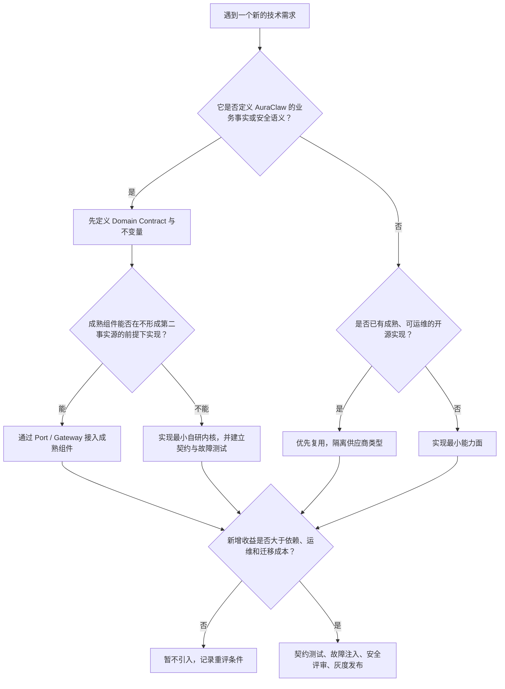

# 技术路线与技术选型

## 1. 先给结论

AuraClaw 的技术路线不是“找一个现成 Agent 框架，再在外面包一层 API”，而是：

> 以 Canonical Session Events 为唯一任务事实源，自研 Managed Agent 的业务内核；在网络、
> 数据库、消息、对象存储、密钥、Web 和前端等通用边界上，尽量复用成熟开源软件和开放协议。

可以把系统分成两类能力：

```text
需要由 AuraClaw 自己定义的业务语义
  Session / Task / Run / Attempt
  状态机、版本、恢复、审批、工具调用事实
  Skill Binding、Artifact lineage、租户与执行权
                         │
                         │ 自研稳定内核
                         ▼
┌─────────────────────────────────────────────────────┐
│              AuraClaw Managed Agent Kernel          │
└─────────────────────────────────────────────────────┘
                         │
                         │ Port / Gateway / Protocol
                         ▼
成熟开源软件或外部基础设施
  FastAPI / Pydantic / httpx
  MySQL / PostgreSQL / Kafka
  SeaweedFS / Vault / Nginx / Docker
  React / TypeScript / Vite
```

这条路线的核心判断是：

- “如何收发 HTTP”“如何连接数据库”已经是成熟通用问题，不应重复造轮子；
- “一个长程 Agent 任务的事实是什么”“如何恢复且不重复副作用”不是通用库能替项目决定的；
- 开源框架可以成为内部执行适配器，但不能成为第二套任务事实源；
- 每增加一个中间件，都要付出部署、监控、升级、权限和故障恢复成本；
- 当前不使用某项技术，不等于永远否定它，而是当前收益还没有覆盖它引入的复杂度。

---

## 2. 选型首先受什么约束

脱离约束谈“哪个技术更先进”没有意义。AuraClaw 的关键约束是：

1. **任务可能运行很久。** 进程、容器、网络和模型调用都可能中途失败。
2. **副作用必须可控。** 发消息、修改数据、调用外部系统不能因为重试而重复执行。
3. **系统是多租户的。** 每次读写、能力发现和工具调用都必须带租户与授权上下文。
4. **执行必须可审计。** 需要知道谁在何时基于什么输入、版本、策略和审批做了什么。
5. **Runtime 不可信任秘密。** Agent Runtime 可以决定调用能力，但不能直接持有第三方凭据。
6. **业务事实不能依赖实时流。** Kafka、SSE 或进程日志丢失时，最终结果仍然必须可恢复。
7. **模型是不确定组件。** 系统必须用确定性状态机、Schema、策略和证据约束模型行为。
8. **当前运维规模有限。** 不能只追求理论扩展能力而忽略部署和排障成本。
9. **项目需要逐阶段交付。** 架构边界要允许从单进程测试适配器演进到多进程生产部署。

因此，选型优先级大致是：

```text
业务正确性
  > 可恢复与可审计
  > 安全边界
  > 可测试和可替换
  > 运维复杂度
  > 性能
  > 技术流行度
```

这里并不是说性能不重要，而是对于 Managed Agent，最危险的失败通常不是“慢了 50 ms”，而是：

- 任务显示成功，但事实没有落库；
- 旧 Runtime 在 Lease 失效后仍然写入；
- 重试造成同一个工具副作用执行两次；
- Projection 与真实事件不一致；
- Runtime 直接接触凭据；
- 模型框架内部状态与平台任务状态互相矛盾。

---

## 3. 整体技术路线是怎样演进的

### 3.1 不是一开始就拆成全套分布式系统

AuraClaw 的早期路线是：

```text
模块化单体
  + 独立 Worker
  + 内存适配器
  + 关系数据库
```

这样做是为了先把领域模型、事件、状态机、Port 和测试闭环做对，而不是在业务语义尚未稳定时，
先承担大量服务发现、消息一致性和分布式调试成本。

随着边界稳定，生产部署演进为多个独立入口：

```text
Ingress / API
Session / Control / Tool / Resource / Model Gateway
Orchestrator / Coordinator / Agent Runtime / Hands
Projection Worker
```

这些组件仍位于同一 Python 代码库并可使用同一不可变镜像。也就是说，AuraClaw 选择的是：

> 代码层保持清晰模块边界，部署层按风险、伸缩和权限需要拆分，而不是强迫“一个目录等于一个微服务”。

### 3.2 先定义事实，再定义执行

技术路线的顺序非常重要：

```text
Canonical Event
  -> 状态机与并发版本
  -> Projection
  -> Command / Control
  -> Lease / Fencing
  -> Agent Runtime
  -> Tool / Resource / Model Gateway
  -> Streaming UI
```

如果反过来，先引入 Agent 框架并让它的内存、Checkpoint 或消息历史成为事实，后续很容易出现：

- 平台任务状态与框架状态不一致；
- 无法解释一次恢复到底从哪里继续；
- 工具调用已经发生，但业务事件没有提交；
- 更换 Agent 框架等于迁移整个业务事实模型。

### 3.3 控制面、数据面和能力面分离

AuraClaw 没有把所有逻辑放进 Agent Runtime：

| 平面 | 主要职责 | 不负责什么 |
|---|---|---|
| Session 事实面 | 保存任务的规范业务事件 | 不运行模型 |
| Control 面 | Lease、Attempt、调度控制和 Fencing | 不修改业务事实语义 |
| Agent Runtime | 推理、步骤推进和能力选择 | 不持有外部秘密，不直接改业务状态 |
| Gateway / Hands | 模型、资源、工具与凭据边界 | 不成为任务事实源 |
| Projection 面 | 构建查询视图 | 不反向覆盖 Canonical Event |
| Runtime Event 面 | 低延迟过程信号 | 不保证最终结果交付 |

这是后续所有技术选型的上层依据。

---

## 4. 当前实际采用了哪些技术

以下是当前仓库和生产部署定义中可以确认的主要选型。

| 层次 | 当前采用 | 主要用途 |
|---|---|---|
| 后端语言 | Python 3.11+ | 领域、API、Worker、Runtime、Gateway |
| 包与构建 | uv、Hatchling | 依赖锁定、开发命令、Python 包构建 |
| Web | FastAPI、Uvicorn | HTTP API、内部服务入口、OpenAPI |
| Schema/配置 | Pydantic、pydantic-settings | 边界校验、DTO、配置加载 |
| HTTP 客户端 | httpx、socksio | 内部服务、模型、Vault、S3、MCP 调用 |
| 数据库 | MySQL 或 PostgreSQL | Canonical Event、Control、Projection、Invocation |
| 数据库驱动 | aiomysql/PyMySQL、asyncpg | 异步运行与迁移 |
| 消息流 | Kafka、aiokafka | Runtime Event 等低延迟流 |
| 对象存储 | SeaweedFS 的 S3 兼容接口 | Artifact 正文与大对象 |
| 密钥管理 | HashiCorp Vault KV v2 | 外部凭据托管 |
| 入口代理 | Nginx | 生产流量入口 |
| 部署 | Docker、Docker Compose | 当前单集群生产拓扑与蓝绿发布 |
| 前端 | TypeScript、React、Next、Vite/vinext | 管理界面与任务交互 |
| 样式 | Tailwind CSS | 前端样式系统 |
| 测试 | pytest、pytest-asyncio | 单元、契约、集成和故障注入测试 |
| 静态质量 | Ruff、Mypy、import-linter | 代码质量、严格类型和架构边界 |
| 协议 | HTTP/JSON、OpenAPI、SSE、MCP JSON-RPC | 服务通信、实时展示和能力协议 |

这里要注意三点：

1. 数据库、Kafka、SeaweedFS、Vault 和 Nginx 是外部基础设施，不属于 Python 进程内库。
2. MySQL 是当前生产配置的默认数据库，代码同时保留 PostgreSQL 适配能力。
3. 使用 MCP 协议不等于把第三方 MCP Server 直接暴露给 Runtime；它仍要经过平台受控边界。

---

## 5. 为什么后端用 Python，前端仍用 TypeScript

### 5.1 Python 后端的收益

AuraClaw 从面向本地 Agent 的 TypeScript/Node 形态转向纯 Python Managed Agent 后端，主要考虑是：

- Python 与模型、数据处理和评测生态连接自然；
- FastAPI、Pydantic 和异步驱动足以支撑 I/O 密集型 Gateway 与 Worker；
- 领域、Runtime、工具执行和测试使用同一后端语言，减少跨语言协议漂移；
- 团队可以更容易编写 Skill Runner、确定性执行器和数据校验逻辑；
- Python 的开发速度适合当前仍在快速稳定领域语义的阶段。

这不是“Python 在所有方面优于 TypeScript”。Python 的代价包括：

- CPU 密集型执行需要进程隔离或外部执行环境；
- 类型约束主要依赖静态检查和运行时 Schema，而非编译器完全保证；
- 异步阻塞调用更容易被误用；
- 多进程部署需要明确处理共享状态，不能依赖进程内单例。

AuraClaw 通过 Worker 隔离、严格 Mypy、Pydantic、异步测试和外部持久化来控制这些风险。

### 5.2 为什么浏览器端仍使用 TypeScript/React

浏览器 UI 的生态中心仍然是 TypeScript 和 React。当前前端采用 React、Next 兼容能力以及
Vite/vinext 工具链，主要为了：

- 组件生态和浏览器类型支持；
- 任务时间线、流式事件、审批和控制台状态的组件化表达；
- 构建速度和 Cloudflare 方向的部署兼容；
- 与后端 OpenAPI/JSON 契约建立清晰边界。

所以项目不是追求“全栈只用一种语言”，而是在每个边界使用最合适的生态。

---

## 6. 为什么用 FastAPI、Pydantic、Uvicorn

### 6.1 FastAPI

选择 FastAPI 的原因：

- 原生异步请求处理适合模型流、内部服务和 I/O 密集场景；
- OpenAPI 自动生成便于内部客户端和契约验证；
- 与 Pydantic 的请求/响应 Schema 配合紧密；
- 多个生产入口可以复用统一的 API 装配方式；
- 依赖注入足够轻量，且可以通过 `composition` 保持基础设施选择在入口层。

AuraClaw 对 FastAPI 的使用边界是：

```text
FastAPI
  负责：路由、认证上下文接入、请求解析、响应映射
  不负责：领域状态机、事务语义、具体适配器选择、任务事实
```

因此 `domain` 和 `contracts` 不允许依赖 FastAPI。未来即使替换 Web 框架，业务内核仍可保留。

### 6.2 为什么没有用 Django

Django 的 ORM、Admin、模板和全栈约定非常成熟，但 AuraClaw 当前并不需要这些能力作为中心：

- 核心写入不是普通 CRUD，而是 expected version、事件追加、Outbox 和锁语义；
- 服务有多个独立入口，不是一个以 Admin/Model 为中心的单体应用；
- 引入 Django ORM 会让核心事务意图更难直接观察；
- 现有前端独立，不需要 Django 模板系统。

如果未来出现大量传统运营后台 CRUD，Django Admin 可以作为独立管理应用重新评估，但不应接管
Canonical Session Event 的写入语义。

### 6.3 为什么没有用 Flask

Flask 足够轻，但 AuraClaw 会自行补回：

- 异步处理约定；
- OpenAPI；
- 请求和响应 Schema；
- 配置与类型校验。

FastAPI 在当前需求下减少了这部分组装工作。

### 6.4 Pydantic 的定位

Pydantic 主要用于不可信边界：

- API DTO；
- 配置；
- 模型输出结构；
- Tool/MCP 请求；
- 数据库行与协议对象的校验。

它不是领域建模的唯一方式。纯领域对象可以使用标准 dataclass 或普通类型，避免业务内核被某个
序列化框架完全绑定。

---

## 7. 为什么使用关系数据库，而且同时支持 MySQL 与 PostgreSQL

### 7.1 为什么 Canonical State 必须进关系数据库

AuraClaw 的核心写入需要同时满足：

- 单 Session 严格版本递增；
- expected version 乐观并发；
- 事件与 Transactional Outbox 原子提交；
- 唯一约束和幂等键；
- Lease/Fencing 的条件更新；
- 工具 Invocation 的状态转换；
- 审批、Artifact 元数据和 lineage 可查询；
- 崩溃后恢复和对账。

这些是关系数据库擅长的问题。把规范任务事实放入文档数据库、向量数据库或仅放入消息队列，
会让跨记录约束、原子性和审计更难。

### 7.2 PostgreSQL 的原始优势

架构最初以 PostgreSQL 为主要参考，原因包括：

- 成熟事务和行锁；
- JSONB；
- Advisory Lock；
- 丰富的约束、索引和 SQL 能力；
- 很适合事件表、Outbox 和 Projection。

### 7.3 为什么现在也支持 MySQL

当前部署环境需要 MySQL，因此项目没有让业务层绑定单一数据库，而是：

- 在稳定 Port 后提供 MySQL/PostgreSQL 适配；
- 迁移脚本按方言管理；
- 用契约测试验证两种实现的相同行为；
- 把必须依赖的事务、锁和 upsert 差异显式封装。

当前生产配置默认 MySQL，但“默认”不等于“领域代码依赖 MySQL”。

### 7.4 为什么没有使用 SQLAlchemy ORM

当前仓库直接使用 `asyncpg`、`aiomysql`/`PyMySQL` 和显式 SQL。原因是核心数据访问包含大量：

- 条件事件追加；
- 行锁；
- 数据库方言差异；
- 原子状态转移；
- fencing 条件；
- outbox claim；
- 批量 projection；
- 数据库角色和权限边界。

这些 SQL 本身就是业务并发语义的一部分。使用 ORM 并不会消除复杂度，只可能把关键 SQL 隐藏在
抽象后面。

直接 SQL 的成本同样真实：

- MySQL/PostgreSQL 双方言维护量更大；
- Schema 重构更依赖高质量集成测试；
- 普通 CRUD 的开发效率低于 ORM；
- SQL 拼装和结果映射需要严格审查。

未来可以在非关键 CRUD Projection 上引入 SQL Toolkit，但 Canonical append、Lease、Invocation
等关键事务不应为了统一风格而隐藏其锁与条件。

### 7.5 为什么没有使用 Alembic

AuraClaw 当前采用自有迁移运行器和显式 SQL，包含：

- migration ledger；
- checksum；
- PostgreSQL/MySQL 锁；
- baseline；
- up/down 文件；
- expand/contract 发布纪律。

原因不是 Alembic 不成熟，而是项目需要双数据库方言、明确 SQL、生产启动门禁和可逆迁移约束，
同时没有使用 SQLAlchemy 元数据作为 Schema 真相。

代价是迁移框架本身也需要维护。若未来组织统一采用 Flyway、Liquibase 或 Alembic，并且能完整
满足双方言、checksum、锁、回滚和发布门禁，可以替换自研 runner；迁移语义不能因此降低。

---

## 8. 为什么 Kafka 只承载实时事件，不承载业务真相

Kafka 与 `aiokafka` 当前用于 Runtime Event 等低延迟流。它适合：

- 高吞吐事件分发；
- Partition 内顺序；
- 多消费者；
- 解耦 Runtime 和实时观察者。

但 AuraClaw 明确不把 Runtime Event 当作结果交付保证：

```text
业务事实提交
  -> Canonical Event + Outbox 同一数据库事务
  -> Outbox 发布
  -> Kafka / SSE 等实时通道
```

如果 Kafka 暂时不可用：

- 业务事实仍然存在；
- Outbox 可以继续发布；
- Projection 可以重建；
- 客户端可以从持久化时间线补齐；
- 不能因为实时流断开就把任务判定为丢失。

### 8.1 为什么不用 Kafka 直接做任务队列和唯一事实源

仅靠 Kafka 很难直接表达 AuraClaw 所需的：

- expected version；
- 多表原子业务约束；
- 当前审批状态；
- Invocation 幂等结果；
- Lease/Fencing 条件写；
- 方便的当前状态查询。

Kafka 是优秀的日志与分发系统，但不必承担所有状态职责。

### 8.2 为什么没有同时引入 RabbitMQ、NATS 或 Pulsar

当前 Kafka 已覆盖实时事件总线需求。再引入第二套 Broker 意味着增加：

- 集群和容量管理；
- ACL 与凭据；
- 监控与告警；
- 备份和升级；
- 两种重试、顺序与投递语义。

目前没有足够收益覆盖这项成本。只有当出现 Kafka 明确无法满足的工作负载，并且通过压测和故障
模型证明需要新 Broker 时，才应重新选择。

---

## 9. 为什么不用 Celery 或 Temporal 作为任务内核

### 9.1 Celery 能解决什么

Celery 擅长：

- 后台任务投递；
- Worker 并发；
- 重试；
- 定时任务；
- 常见 Broker 集成。

但 AuraClaw 的问题不只是“把一个函数丢给 Worker”。系统还必须处理：

- Session 版本；
- Run/Attempt 关系；
- 长程步骤 Checkpoint；
- 工具副作用幂等；
- Lease 与 Fencing；
- 审批暂停；
- Dynamic DAG；
- Artifact lineage；
- Canonical Event 与结果交付。

即使使用 Celery，这些领域机制仍要自行建设。让 Celery task state 再成为一套状态，还会增加
对账问题。因此当前没有引入。

Celery 未来可以承载与业务事实弱相关的后台工作，例如图片缩略、过期清理，但不能成为 Session
事实源。

### 9.2 Temporal 能解决什么

Temporal 对 Durable Execution、重试、定时器和 Workflow History 有很强能力，是比普通队列
更接近 AuraClaw 问题空间的开源软件。

当前没有采用的主要原因是：

1. AuraClaw 已经把 Canonical Session Event 定义为唯一业务事实；
2. Temporal Workflow History 若同时描述任务生命周期，容易形成第二套真相；
3. Agent 的动态计划、审批和外部工具副作用仍需映射到平台自己的 Policy、Invocation 和事件；
4. Temporal 的确定性重放约束、Worker 版本管理和集群运维需要团队掌握；
5. 当前规模下，自有 Control Store、Lease 和 Checkpoint 已覆盖主要交付目标。

这不是对 Temporal 能力的否定。如果未来出现：

- 跨天或跨月的大量 Timer；
- 跨区域 Durable Execution；
- 数量巨大的并行 Workflow；
- 自研调度与恢复的维护成本持续高于集成成本；

可以把 Temporal 作为 Control/Scheduling Adapter 重新评估。但必须先回答：

> Temporal History 与 Canonical Session Events 谁拥有什么事实，如何单向映射，如何避免双主。

---

## 10. 为什么没有采用 LangChain、LangGraph、AutoGen、CrewAI 等作为核心

这些框架提供 Prompt、Tool、Agent Loop、Graph、Memory 或 Multi-Agent 协作能力，适合快速构建
原型。AuraClaw 当前没有把它们作为核心依赖，原因是平台需要自己掌握以下语义：

- 每个任务状态变化的 Canonical Event；
- 每一步的租户、actor、correlation、causation；
- Skill 和 Tool 的固定版本绑定；
- 审批动作摘要；
- Invocation 幂等与副作用恢复；
- Lease/Fencing；
- Resource revision 与 digest；
- Runtime 与 Credential 的隔离；
- Projection 可删除重建。

如果框架同时维护自己的：

- Memory；
- Checkpointer；
- Tool retry；
- Graph state；
- Message history；
- Agent run status；

就可能与 AuraClaw 形成双状态机。

### 10.1 这是否意味着永远不能用 Agent 框架

不是。正确边界是：

```text
AuraClaw 拥有 Task、State、Policy、Invocation 和 Canonical Event
                         │
                         ▼
某个 Agent 框架可以作为 Agent Harness 的内部适配器
                         │
                         ▼
所有数据、工具和副作用仍通过 AuraClaw Gateway/Port
```

引入候选框架前至少要验证：

- 可以关闭或替换它的持久化；
- 可以接管每一步 Tool Dispatch；
- 可以注入平台 Checkpoint；
- 可以传递 tenant/correlation/causation；
- 可以关闭隐藏重试；
- 不要求 Runtime 持有 Provider/Tool Secret；
- 升级不会改变任务事实兼容性。

只要满足这些条件，框架可以减少 Agent Loop 开发量；不满足时，节省的原型代码会变成生产状态
不一致的成本。

---

## 11. 为什么参考 OpenClaw，但没有继续把它作为后端基础

OpenClaw 类系统在 Channel、Plugin、Tool 和本地 Agent 交互方面提供了很多可借鉴设计。但其典型
形态更偏向：

- Node/TypeScript Gateway；
- 本地或个人 Agent；
- Channel 与 Agent Loop 深度协作；
- 进程内插件和工具生态；
- 全局配置或本地 Session。

AuraClaw 的目标是 Managed Agent 后端，额外要求：

- 多租户；
- 多生产进程；
- 权限分离；
- 长程任务恢复；
- Canonical Event；
- 外部凭据隔离；
- 审批和审计；
- 可水平扩展的 Artifact 和 Projection。

如果继续在原有 Gateway、Channel、Agent、Tool 的耦合结构上修改，需要不断绕过原始假设。因此
项目选择吸收有价值的交互与插件思想，但重建 Python 业务内核。

这个决定不是“开源项目代码质量不好”，而是产品边界不同：

```text
个人/本地 Agent 的最优架构
        ≠
多租户 Managed Agent 平台的最优架构
```

---

## 12. 为什么采用 HTTP/JSON 和 OpenAPI，而不是 gRPC

内部服务当前主要使用 HTTP/JSON，并通过 OpenAPI 和稳定 Contract 管理。收益是：

- 请求和错误容易观察、抓包和重放；
- Python、前端和运维工具都能直接使用；
- OpenAPI 便于生成或校验客户端；
- Nginx、健康检查和调试工具成熟；
- 当前调用规模不需要优先优化二进制序列化开销。

没有采用 gRPC 的原因是当前收益不足以覆盖：

- Protobuf Schema 和生成物管理；
- HTTP/2 基础设施要求；
- 浏览器和运维调试成本；
- 多套错误和网关转换语义；
- 团队学习与发布复杂度。

如果未来服务间吞吐、流控或跨语言强类型需求成为明确瓶颈，可以在高频内部链路局部采用 gRPC，
不需要把所有管理 API 一次性迁移。

MCP 是例外：Runtime 到 Hands/能力边界使用 MCP 定义的 JSON-RPC/Streamable HTTP，是为了兼容
开放能力协议，而不是另造内部 RPC 标准。

---

## 13. 为什么浏览器实时更新使用 SSE，而不是 WebSocket

任务过程主要是服务端向浏览器单向推送：

```text
Server -> 状态、日志、步骤、结果 -> Browser
Browser -> 控制命令             -> HTTP API
```

SSE 的优势：

- 浏览器原生支持；
- 自动重连；
- 可以使用 `Last-Event-ID` 补读；
- 与普通 HTTP、代理和鉴权模型接近；
- 单向语义更符合当前需求。

改变业务状态的操作仍走经过认证、幂等和版本校验的 HTTP Command，而不是混进长连接消息。

WebSocket 适合高频双向交互、协同编辑或音视频控制。如果未来出现这些真实需求，可以增加专用
通道；当前使用它只会扩大连接管理和安全边界。

---

## 14. 为什么采用 MCP，但不让 MCP 接管任务

AuraClaw 使用 MCP 的价值是统一表达：

- Resources；
- Tools；
- Prompts；
- 能力发现和调用协议。

但 MCP 在 AuraClaw 中是能力协议，不是：

- Session 事实源；
- Workflow Engine；
- Approval Store；
- Artifact lineage 数据库；
- Runtime 获取第三方秘密的通道。

外部 MCP 能力先进入受管 Catalog 和 Gateway，经过：

```text
tenant visibility
  -> capability status
  -> schema validation
  -> policy
  -> approval
  -> credential injection
  -> invocation record
  -> result validation
```

Runtime 不直接连接任意第三方 MCP Server。这样既利用生态协议，又不把租户、审计和凭据边界
交给外部 Server。

当前也不把 MCP 实验性的 Task 语义映射为 AuraClaw Task，因为两者生命周期、事实和恢复含义
不同。名称相同不代表领域概念相同。

---

## 15. 为什么使用 SeaweedFS，而不是本地目录或数据库 Blob

Artifact 的元数据、digest、租户、状态和 lineage 放在关系数据库；大对象正文放在 SeaweedFS
的 S3 兼容接口。

选择对象存储的原因：

- 多个 Runtime/Worker 可以访问相同 Artifact；
- 容器销毁不会丢文件；
- 支持大文件、Multipart 和签名 URL；
- 数据库不承担大对象传输压力；
- 内容与元数据可以分别伸缩。

### 15.1 为什么不用本地共享目录

本地目录在单机开发中简单，但生产环境会造成：

- 容器/主机亲和；
- 多副本看不到相同文件；
- 蓝绿发布迁移困难；
- 权限和备份不统一；
- 本地路径泄漏到业务契约。

因此共享本地 Artifact 目录被明确排除为生产方案。

### 15.2 为什么没有再引入 MinIO

当前环境已有 SeaweedFS 且提供 S3 兼容能力。再部署 MinIO 会增加第二个对象存储而没有明显收益。
如果未来基础设施改用云 S3、MinIO 或其他兼容实现，上层仍应通过 Artifact Port 替换。

### 15.3 为什么没有使用 boto3

当前代码使用 `httpx` 实现了所需的有限 S3 SigV4、Presign 和 Multipart 表面。好处是：

- 异步调用模型一致；
- 依赖更少；
- 所需能力面很小；
- 测试可以精确控制请求。

代价是签名、XML、重试、区域和兼容性都要自己维护。若未来需要完整 S3 API、复杂凭据链、
服务端加密或更多兼容目标，应优先评估成熟 S3 SDK，而不是持续扩展自研协议客户端。

---

## 16. 为什么使用 Vault，而且 Runtime 不读取秘密

Vault KV v2 作为外部 Credential 的保存位置。核心安全链路是：

```text
Runtime 请求逻辑 Credential
  -> Tool/Model Gateway 校验权限和策略
  -> Credential Proxy 从 Vault 读取
  -> 在最靠近外部调用的位置注入
  -> Runtime 和事件中不出现明文秘密
```

生产环境不应把第三方长期密钥放入代码、数据库普通字段、`.env` 或 Runtime 配置。

当前使用 `httpx` 实现最小 Vault KV v2 客户端，没有引入 `hvac`。原因与 S3 客户端相似：目前只需
很小且可控的 API 表面。若后续引入动态凭据、租约续期、PKI、Transit 或多认证方式，成熟 Vault
SDK 的收益会明显上升，应重新评估。

---

## 17. 为什么当前部署选择 Docker Compose，而不是 Kubernetes

当前生产目标是一个明确的 Compose 集群，使用：

- 一个不可变应用镜像；
- 多个独立服务入口；
- 显式副本；
- 健康检查；
- CPU/内存限制；
- 内部网络；
- 只读文件系统、非 root 用户、capability drop；
- Secret 文件挂载；
- Nginx 入口；
- 蓝绿发布和数据库迁移门禁。

选择 Compose 的现实原因：

- 当前部署仍在单一故障域；
- 团队可以直接理解和排查完整拓扑；
- 不需要先维护 Kubernetes 控制面、Ingress、Operator 和大量 YAML；
- 服务边界已经拆开，将来迁移编排平台不需要重写业务代码；
- 当前规模可以通过显式副本和资源限制满足。

当前方案也有明确上限：

- 没有 HPA；
- 没有 PDB；
- 没有 Kubernetes NetworkPolicy；
- 跨主机自愈和滚动调度能力有限；
- 一个 Compose 集群仍处在同一故障域。

当业务需要多主机调度、跨可用区、高级弹性、标准化 Secret/Network Policy 或平台团队统一治理时，
Kubernetes 才会成为收益大于成本的选择。迁移时应保持应用 Port 和无状态入口不变。

---

## 18. 为什么当前没有 Redis

仓库当前没有 Redis 适配器。持久状态主要放在关系数据库，短暂实时事件使用 Kafka。

没有为了“架构看起来完整”而提前加 Redis，原因是：

- Lease、Fencing、幂等和恢复数据必须持久且与业务事务协调；
- SQL 已经能提供当前需要的条件更新和索引；
- 再加 Redis 会增加缓存一致性、过期和故障切换问题；
- 错误地把 Redis 当事实源会破坏恢复保证。

未来以下需求经过测量后可以引入 Redis：

- 高频且允许短暂不一致的缓存；
- 分布式限流；
- 临时 presence；
- 极高吞吐、非规范性的短期协调。

即使引入，也不能代替 Canonical Event、Invocation 或需要审计的审批状态。

---

## 19. 为什么当前没有向量数据库或 OpenSearch

Agent 系统经常会默认搭配向量数据库，但 AuraClaw 当前的 Capability Catalog 仍采用可解释的
关键词检索，没有在代码中引入向量数据库或 OpenSearch。

当前不引入的原因是：

- Catalog 规模尚未证明关键词和关系数据库索引成为瓶颈；
- 关键词打分结果稳定、可解释，适合先验证 Capability Binding 全链路；
- Embedding 会额外引入模型版本、重建、相似度阈值和租户过滤问题；
- 搜索引擎或向量数据库会增加一套 Projection、一致性和运维成本；
- 语义召回率提高不等于最终选对能力，仍需要策略、Schema 和适用条件校验。

这里必须诚实说明：关键词检索对同义词、自然语言表达和大规模 Catalog 的召回能力有限。未来当
离线评测证明主要错误来自召回，而不是 Capability 描述、策略或模型选择时，可以采用混合检索：

```text
关键词召回
  + Embedding 召回
  + tenant / permission / status 硬过滤
  + 可解释重排
  + Skill applies_when / not_when 校验
```

即使加入向量数据库，Capability 的规范元数据、版本和 Binding 仍应保存在关系数据库中；向量
索引只是可重建的 Projection。

---

## 20. 为什么没有引入通用 Event Sourcing 框架

AuraClaw 使用了 Event Sourcing 的关键思想：

- Canonical Event；
- 乐观并发；
- Projection；
- Outbox；
- Replay；
- 版本化状态机。

但没有引入通用 Event Store 框架。原因是 Session Event 还要与项目特有的以下语义结合：

- tenant；
- actor；
- correlation/causation；
- command id；
- expected version；
- Artifact；
- Approval；
- Invocation；
- Control Store 与业务状态隔离。

通用框架能减少事件追加样板，但仍需要大量适配，并可能把数据布局、序列化和 Snapshot 策略变成
框架约束。当前自研实现保持语义直接可见。

它的代价是必须长期维护兼容性、回放、Schema 演进和性能。只有在候选框架能够证明：

- 不改变 Canonical Event Contract；
- 支持双数据库或明确的迁移路径；
- 支持现有 Outbox 和租户隔离；
- 不成为不可替换的隐藏事实层；

才值得替换。

---

## 21. 为什么 Policy 和 Approval 没有直接交给 OPA/Cedar

当前策略、风险分级、审批状态和 Action Digest 与 AuraClaw 的工具调用生命周期紧密结合。通用
Policy Engine 可以很好地回答：

```text
subject + resource + action + context -> allow / deny
```

但它通常不直接负责：

- 审批请求的业务状态；
- Action Digest 防止“批 A 执行 B”；
- Invocation 幂等；
- Canonical Event；
- 人工操作的 actor/correlation/causation；
- 工具结果和 Artifact lineage。

因此当前没有让 OPA 或 Cedar 成为这套业务状态的所有者。未来规则数量、跨产品复用和策略管理
需求增长后，可以把它们作为纯策略判定器接入；审批生命周期仍由 AuraClaw 保存。

---

## 22. 为什么没有完整接入 OpenTelemetry

当前系统已经要求 trace、correlation、causation、指标和审计时间线等可观测字段，但仓库中尚未
引入完整的 OpenTelemetry SDK/Exporter。

当前优先级是先保证：

- 业务事件可追踪；
- Command 到 Event 的因果链可恢复；
- Tool Invocation 有审计记录；
- 任务状态不依赖短期 Trace 保存。

这能解决“业务上发生了什么”，但不等于完整解决“每个进程、RPC 和外部依赖为什么慢”。随着生产
流量增加，OpenTelemetry 是合理的后续补充，用于：

- 跨服务 Trace；
- 标准 Metrics；
- HTTP/DB/Kafka 自动插桩；
- 与现有观测平台对接。

接入时要以 correlation/causation 作为业务关联，不应让短保留期 Trace 代替持久审计事件。

---

## 23. 为什么自研轻量协议客户端，而没有到处引入官方 SDK

当前代码对 OpenAI-compatible Model API、Vault KV v2、SeaweedFS S3 和 MCP 使用了相对轻量的
协议适配器。共同动机是：

- 只暴露项目真正允许的能力面；
- 统一使用异步 `httpx`；
- 可以注入测试 Transport；
- 避免 SDK 隐藏重试、全局配置或凭据读取；
- Gateway 能掌握日志、超时、策略和错误映射；
- 降低大体积传递依赖。

这是有条件的选择，不是“自己写 HTTP 永远更好”。自研客户端的风险包括：

- 协议升级需要跟进；
- 边界条件覆盖不如成熟 SDK；
- 签名、流式解析和重试容易出现安全或兼容问题；
- 团队承担更多测试责任。

判断是否改用 SDK 的标准应是：

```text
协议能力面扩大
  或认证/重试显著复杂
  或兼容目标增加
  或自研缺陷成本上升
        >
SDK 引入的依赖、隐藏行为和边界失控成本
```

无论是否使用 SDK，都必须包在 AuraClaw Gateway/Port 后面，不能让业务代码直接依赖 Provider。

---

## 24. 质量工具为什么也是架构选型

AuraClaw 使用：

- `pytest` / `pytest-asyncio`；
- `Ruff`；
- 严格 `Mypy`；
- `import-linter`；
- 迁移、架构、功能、安全和文档发布门禁。

这些不只是开发便利工具。它们把架构规则变成可执行约束：

```text
domain/contracts 不依赖 FastAPI 或 infrastructure
entrypoint 只能通过 composition 装配
api/gateway 不选择具体基础设施
跨顶级模块使用 auraclaw.* 绝对导入
```

没有 import-linter 时，这些规则只能依靠评审者记忆；项目扩大后很容易逐渐失效。

严格类型也不能证明业务正确，但可以提前发现：

- Optional 状态遗漏；
- DTO 与 Domain 混用；
- 异步接口不一致；
- Port 实现签名漂移；
- 事件 Payload 处理错误。

因此质量工具属于技术路线的一部分，而不是项目完成后再补的装饰。

---

## 25. “哪些自研，哪些复用”的完整边界

### 25.1 适合复用成熟实现

| 问题 | 策略 |
|---|---|
| HTTP Server | 使用 FastAPI/Uvicorn |
| JSON/配置校验 | 使用 Pydantic |
| HTTP Client | 使用 httpx |
| 数据持久化引擎 | 使用 MySQL/PostgreSQL |
| Event Broker | 使用 Kafka |
| Artifact 对象存储 | 使用 SeaweedFS S3 |
| Secret Store | 使用 Vault |
| 反向代理 | 使用 Nginx |
| 容器与当前编排 | 使用 Docker/Compose |
| 浏览器 UI | 使用 React/TypeScript 生态 |
| 测试和静态分析 | 使用 pytest/Ruff/Mypy/import-linter |
| 能力互操作协议 | 使用 MCP |

### 25.2 必须由 AuraClaw 掌握

| 问题 | 自研原因 |
|---|---|
| Canonical Session Event | 它定义业务真相 |
| Session/Task/Run/Attempt 状态机 | 它定义生命周期和恢复语义 |
| expected version/command id | 它定义并发和幂等 |
| Projection 重建规则 | 它定义读模型与事实的关系 |
| Lease/Fencing | 它定义唯一有效执行权 |
| Agent Harness/Capability Loop | 它必须受平台状态和策略约束 |
| Skill Binding | 它定义可复现的能力版本 |
| Policy/Approval lifecycle | 它定义高风险行为授权 |
| Tool Invocation Store | 它定义副作用的 exactly-once effect 边界 |
| Artifact metadata/lineage | 它定义结果证据和依赖关系 |
| Resource Gateway | 它定义数据访问、版本和租户边界 |
| Credential Proxy | 它定义 Runtime 与秘密的隔离 |
| Result delivery semantics | 它不能依赖瞬时流 |

### 25.3 可以替换，但必须藏在 Port 后

| 当前实现 | 可替换候选 | 不可改变的不变量 |
|---|---|---|
| MySQL/PostgreSQL Adapter | 其他关系数据库/托管数据库 | Event 版本、事务、Outbox、幂等 |
| Kafka | 其他 Event Bus | Runtime Event 不能成为唯一事实 |
| SeaweedFS | S3/MinIO/其他对象存储 | Artifact digest、租户、lineage |
| Vault | 云 Secret Manager | Runtime 不见明文秘密 |
| 自研 Model Adapter | 官方或第三方 SDK | Gateway、策略、超时、审计 |
| 自研 Agent Harness | LangGraph 等适配器 | 平台拥有状态和副作用 |
| Compose | Kubernetes/其他编排 | 入口、角色、网络和 Secret 边界 |
| 自研 Policy Evaluator | OPA/Cedar | Approval/Invocation 仍是业务事实 |

---

## 26. 选型中最容易产生的误解

### 误解一：自研越多，平台控制力越强

错误。HTTP Server、数据库、消息系统、对象存储和密码学协议应尽量复用成熟实现。自研范围应该
集中在真正具有产品差异的业务语义。

### 误解二：用了 Kafka，就是 Event Sourcing

错误。AuraClaw 的 Canonical Event 在关系数据库中，Kafka 主要是分发和实时流。Event Sourcing
取决于事实模型和回放语义，不取决于是否使用某个 Broker。

### 误解三：用了 Agent 框架，就自动获得长程任务可靠性

错误。框架 Checkpoint 不能自动解决租户、审批、副作用幂等、Fencing、Artifact lineage 和最终
交付。

### 误解四：不用 Kubernetes 就不是生产架构

错误。生产能力取决于故障模型是否被覆盖。Compose 当前覆盖单集群目标，但必须诚实承认它不覆盖
跨主机和跨可用区能力。

### 误解五：不用 ORM 就没有抽象

错误。AuraClaw 的抽象在稳定 Port、事务契约和领域语义上；SQL 是否显式是另一层选择。

### 误解六：支持两个数据库就意味着所有数据库都能支持

错误。可移植性来自有范围的 Contract 和适配器，不是 SQL 完全无差异。新增数据库必须重新验证
锁、事务隔离、upsert、JSON 和迁移语义。

### 误解七：当前没用某项开源软件，就是认为它不好

错误。大多数未采用结论是“当前成本收益不成立”，不是永久技术立场。

---

## 27. 未来重新选型时，应使用什么标准

每次引入或替换基础组件，都应回答以下问题。

### 27.1 事实所有权

- 它是否保存了一套新的任务状态？
- 这套状态与 Canonical Event 如何映射？
- 冲突时以谁为准？
- 能否从 Canonical Event 重建？

### 27.2 故障语义

- 超时后操作到底有没有发生？
- 重试是否会重复副作用？
- 消费者崩溃后从哪里恢复？
- 旧执行者如何被 Fencing？

### 27.3 安全边界

- Runtime 是否因此接触秘密？
- tenant context 能否贯穿？
- 是否支持最小权限和独立数据库角色？
- 日志或 Trace 是否可能泄密？

### 27.4 可替换性

- 是否位于 Port/Gateway 后？
- 业务对象是否泄漏供应商类型？
- 是否可以用 Fake/Contract Test 替代？
- 升级是否改变业务事件兼容性？

### 27.5 运维成本

- 需要新集群吗？
- 如何备份、升级、监控和告警？
- 团队是否能在故障时独立排查？
- 它减少的代码量是否真的高于新增运维量？

### 27.6 性能证据

- 当前瓶颈经过测量了吗？
- 是数据库、网络、模型、Broker 还是代码问题？
- 新技术解决的是主要瓶颈还是理论瓶颈？

### 27.7 退出策略

- 项目停更、协议变化或许可证变化时怎么办？
- 数据如何导出？
- 是否能双写、回放或灰度迁移？
- 回滚条件是什么？

---

## 28. 一张总决策图



---

## 29. 核对当前实现的阅读入口

本文不是脱离代码的理想设计。继续核对实现时，可以从以下入口开始：

- [Python 依赖与静态质量配置](../../pyproject.toml)
- [前端依赖与构建配置](../../frontend/package.json)
- [生产 Compose 拓扑](../../compose.production.yml)
- [系统架构目录](../Managed%20Agent%20系统架构/)
- [模块重构方案](../Managed%20Agent%20模块重构方案.md)
- [开发阶段校验清单](../开发阶段校验清单.md)
- [后端源码](../../src/auraclaw/)
- [测试目录](../../tests/)

阅读代码时，建议始终用本文的三个问题检查：

1. 这段代码是在写业务事实、派生视图，还是短暂运行信号？
2. 它依赖的开源组件是否被 Port/Gateway 隔离？
3. 组件故障或被替换后，Canonical Event 能否继续解释并恢复任务？

---

## 30. 最终心智模型

理解 AuraClaw 的技术选型，只需要记住四句话：

1. **关系数据库中的 Canonical Session Events 才是任务事实，流、缓存和 Projection 都不是。**
2. **决定业务正确性和安全边界的语义由 AuraClaw 掌握，通用基础能力优先复用开源软件。**
3. **任何框架或中间件都必须位于 Port/Gateway 后，不能成为隐藏的第二状态机或秘密旁路。**
4. **选型是阶段性成本收益判断；保留替换边界和明确重评条件，比追求一劳永逸更重要。**

因此，AuraClaw 既不是“全部自研”，也不是“开源组件拼装”。更准确的描述是：

> 自研不可外包的 Managed Agent 语义，复用已经被行业验证的基础设施，并用契约、事件和安全边界
> 把两者连接起来。
